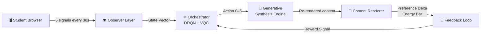
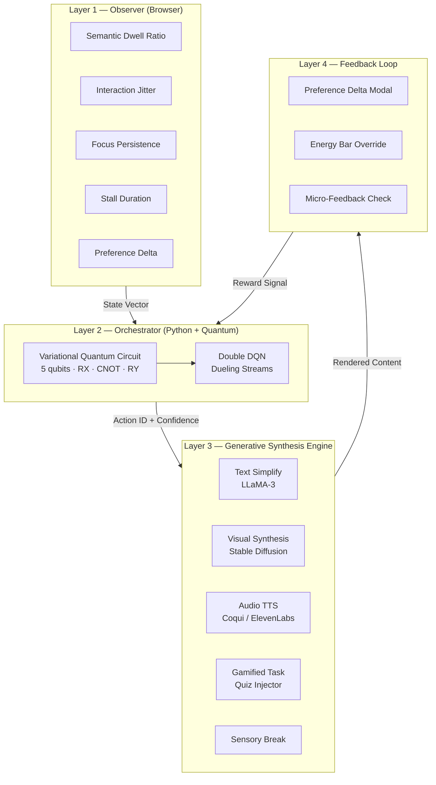
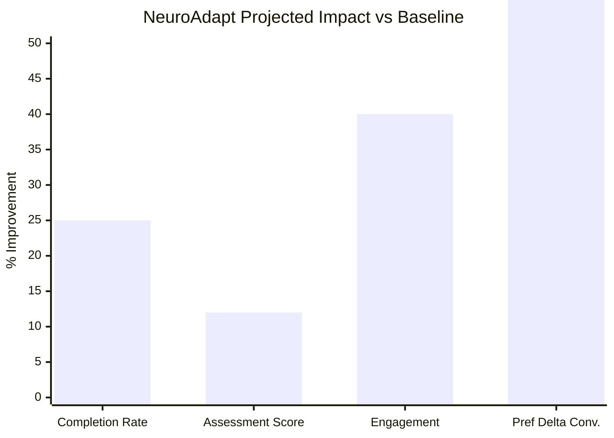

<div align="center">

# 🧠 NeuroAdapt
### The Autonomous Neuro-Diverse Learning Ecosystem

*Turning education into a responsive, empathetic dialogue — one learner at a time.*

<br/>

[](LICENSE)
[](https://python.org)
[](https://nextjs.org)
[](https://pennylane.ai)
[](https://fastapi.tiangolo.com)
[](https://docker.com)
[](https://wandb.ai)

<br/>

> **RVCE × Unisys Innovation Programme 2025**
> Prarthana Upadhyaya · Sudarshan S. Niranjan · Varun Aditya

</div>

---

## 📌 The Problem

> *"One size fits all" is a design flaw, not a pedagogy.*

**20% of undergraduates are neurodivergent** — diagnosed with ADHD, dyslexia, dyscalculia, or autism spectrum conditions. Yet every digital learning platform they use was designed for a hypothetical average student that does not exist.

The consequences are measurable and severe:

| Metric | Neurodivergent Students | Neurotypical Peers |
|---|---|---|
| Course completion rate | **26% lower** | Baseline |
| Average GPA gap | **−0.6 grade points** | Baseline |
| High school graduation rate | **35%** lack adequate support | — |
| Formal diagnosis (India) | Costs ₹15,000+ | Not required |

NeuroAdapt eliminates the design flaw at the infrastructure level — no diagnosis required, no accommodation forms, no opt-in. **The platform adapts to the learner. The learner does not adapt to the platform.**

---

## ✨ What NeuroAdapt Does

NeuroAdapt watches five **passive behavioural signals** every 30 seconds, builds a real-time model of the learner's cognitive state, and autonomously selects from six interventions to maintain optimal engagement — before the student even realises they are struggling.



---

## 🏗️ System Architecture

NeuroAdapt is a four-layer system where each layer has a single, well-defined responsibility:



---

## 🗂️ Repository Structure

```
NeuroAdapt/
├── 📁 frontend/        Next.js 14 · Observer telemetry · Student & Educator UI
├── 📁 backend/         FastAPI · Session management · Plausibility middleware
├── 📁 quantum/         PennyLane VQC · DDQN training · Reward engineering
├── 📁 gen-engine/      LLaMA-3 · Stable Diffusion · Coqui TTS · Quiz injector
├── 📁 infra/           Docker Compose · Nginx · Prometheus · Grafana
├── 📁 shared/          Auto-generated constants · Pydantic + TypeScript types
├── 📁 docs/            Architecture · API reference · Ethics · Deployment guides
├── 📁 research/        Literature survey · Ablation results · POC data
└── 📄 shared_config.py Canonical constants — single source of truth
```

> 📖 Each folder has its own detailed README. Click any folder name above or see the links below.

**Folder READMEs:**
- [`frontend/README.md`](frontend/README.md)
- [`backend/README.md`](backend/README.md)
- [`quantum/README.md`](quantum/README.md)
- [`gen-engine/README.md`](gen-engine/README.md)
- [`infra/README.md`](infra/README.md)
- [`shared/README.md`](shared/README.md)
- [`docs/README.md`](docs/README.md)
- [`research/README.md`](research/README.md)

---

## ⚙️ Quick Start

### Prerequisites

| Tool | Version | Purpose |
|---|---|---|
| Docker + Compose | v2.x | Full stack containerisation |
| Node.js | 20+ | Frontend development |
| Python | 3.11 | Backend + quantum modules |
| Ollama | Latest | Local LLaMA-3 inference |

### 1. Clone & Configure

```bash
git clone https://github.com/varunaditya27/NeuroAdapt.git
cd NeuroAdapt
cp .env.example .env
# Fill in your API keys in .env
```

### 2. Sync Shared Constants

```bash
python infra/scripts/sync_config.py
# Generates shared/config.ts and shared/types/state_vector.ts
```

### 3. Launch Full Stack

```bash
docker compose -f infra/docker-compose.yml up --build
```

### 4. Seed Demo Data

```bash
bash infra/scripts/seed_demo.sh
# Loads 3 pre-baked learner profiles: ADHD · Dyslexia · Neurotypical
```

### 5. Access

| Service | URL |
|---|---|
| Student UI | http://localhost:3000 |
| Educator Dashboard | http://localhost:3000/educator/insights |
| FastAPI Docs | http://localhost:8000/docs |
| Grafana Monitoring | http://localhost:3001 |

---

## 🧪 The Six Interventions

| Action ID | Name | Trigger Condition |
|---|---|---|
| `0` | **Hold Course** | Learner is in stable engagement |
| `1` | **Soft Nudge** | Mild inattention, not yet critical |
| `2` | **Simplify Text** | High dwell + low progress (reading wall) |
| `3` | **Switch to Video** | Persistent text-format mismatch |
| `4` | **Inject Gamified Task** | High tab-switching + escalating stall |
| `5` | **Sensory Break** | Multi-signal overload state detected |

> ⚛️ All six actions are selected by the Hybrid Quantum-Classical Policy Network. See [`quantum/README.md`](quantum/README.md) for the full VQC architecture.

---

## 📊 Expected Outcomes



---

## 👥 Team

| Member | Role | Primary Modules |
|---|---|---|
| **Prarthana Upadhyaya** | Frontend · Observer · QML Integration | `frontend/` · `shared/` |
| **Sudarshan S. Niranjan** | Backend · Orchestrator · Quantum Core | `backend/` · `quantum/` |
| **Varun Aditya** | Gen Engine · Feedback Loop · DevOps | `gen-engine/` · `infra/` |

---

## 🔬 Research Foundation

NeuroAdapt is grounded in peer-reviewed evidence across four research domains:

- **EndeavorRx RCT (Leitner et al., 2024)** — FDA-authorised adaptive game produces clinically significant attention improvements in ADHD
- **Clément et al., 2015** — Multi-Armed Bandits outperform expert-designed curricula in live classroom deployments
- **Bhatia et al. / Cao et al., 2025** — VQCs converge faster than classical baselines in early training epochs
- **Langberg et al., 2021** — ADHD students maintain 0.5–0.6 GPA gap under standard instruction across all four college years

> 📖 Full literature survey: [`research/lit_survey.md`](research/lit_survey.md)

---

## 📜 Branching Strategy

```
main          ← stable, demo-ready
dev           ← integration branch
feature/*     ← individual features (e.g. feature/trajectory-buffer)
quantum/*     ← quantum experiments (e.g. quantum/ablation-c)
```

---

<div align="center">

---

*Built at R. V. College of Engineering, Bengaluru*
*Unisys Innovation Programme 2025*

**🧠 NeuroAdapt — Because every brain deserves a platform built for it.**

</div>
