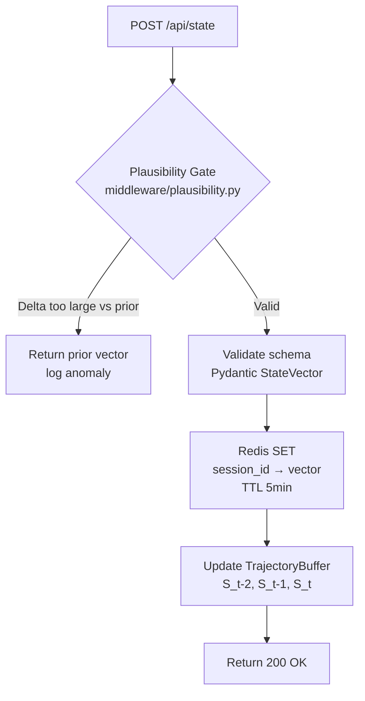
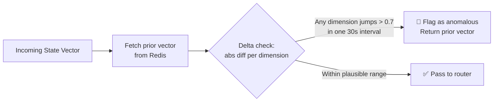
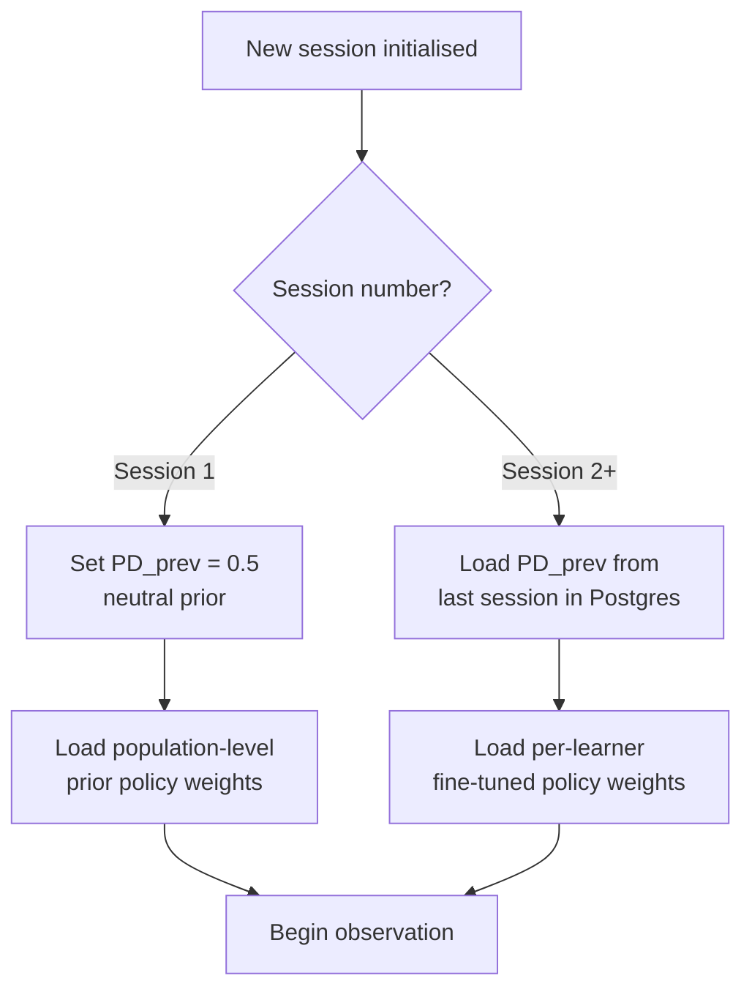
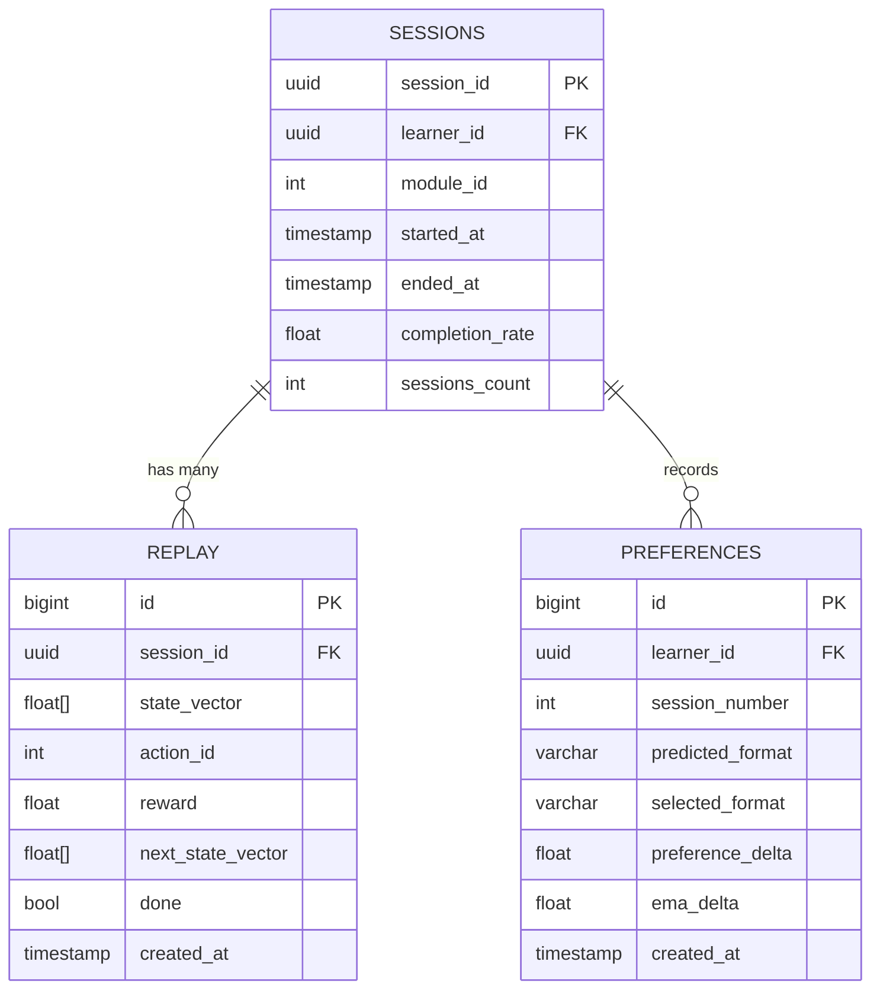

<div align="center">

# ⚙️ backend
### FastAPI · Session Management · Plausibility Middleware

*The nervous system of NeuroAdapt — routing signals, enforcing safety, and managing state.*

[](https://fastapi.tiangolo.com)
[](https://python.org)
[](https://postgresql.org)
[](https://redis.io)

> **Primary Owner:** Sudarshan S. Niranjan
> **Supports:** Varun (feedback endpoint, reward routing)

</div>

---

## 🎯 Responsibility

The `backend/` module is the API layer that sits between the browser and the quantum/generative subsystems. It owns:

- **State ingestion** — receiving, validating, and plausibility-checking state vectors from the Observer
- **Action dispatch** — calling the Orchestrator policy and returning `action_id` + confidence
- **Feedback routing** — receiving Energy Bar and Preference Delta signals, computing rewards
- **Session lifecycle** — managing cold-start, per-learner state, and replay buffer persistence

---

## 🗂️ Directory Layout

```
backend/
├── main.py                 # FastAPI app entry — registers all routers + middleware
├── routers/
│   ├── state.py            # POST /api/state
│   ├── action.py           # GET  /api/action
│   ├── feedback.py         # POST /api/feedback
│   └── health.py           # GET  /health (liveness probe)
│
├── middleware/
│   ├── auth.py             # JWT validation (stateless, no PII)
│   ├── rate_limit.py       # Per-session rate limiting on /api/generate
│   └── plausibility.py     # Adversarial input gate — checks state delta vs Redis history
│
├── services/
│   ├── orchestrator_client.py  # HTTP client to quantum inference endpoint
│   ├── redis_client.py         # State vector cache (TTL 5 min, sub-5ms reads)
│   ├── session_manager.py      # Per-learner session state + cold-start handling
│   └── reward_router.py        # Routes reward signals to quantum/reward.py
│
├── models/
│   ├── state_vector.py     # Pydantic: StateVector, TrajectoryWindow (3×5 dims)
│   ├── feedback.py         # Pydantic: FeedbackPayload, MicroFeedbackPayload
│   └── action.py           # Pydantic: ActionResponse
│
├── db/
│   ├── postgres.py         # SQLAlchemy async engine
│   ├── migrations/         # Alembic versioned migrations
│   └── schemas.sql         # Reference schema (sessions, replay, preferences tables)
│
└── __tests__/
    ├── test_state.py
    ├── test_feedback.py
    ├── test_plausibility.py
    └── test_session_manager.py
```

---

## 🔌 API Endpoints

### `POST /api/state`
Receives the normalised 5-dimensional state vector from the Observer every 30 seconds.

**Request Body:**
```json
{
  "session_id": "uuid",
  "state_vector": [0.3, 0.7, 0.2, 0.1, 0.5],
  "timestamp": 1712050000
}
```

**Processing pipeline:**



---

### `GET /api/action`
Calls the Orchestrator policy and returns the selected intervention.

**Response:**
```json
{
  "action_id": 2,
  "action_name": "simplify_text",
  "confidence": 0.74,
  "trigger_gen_engine": true
}
```

> ⚛️ `trigger_gen_engine` is `true` only when `confidence ≥ 0.60`. Below this threshold, the frontend shows a skeleton loader and defaults to `action_id = 0`.

---

### `POST /api/feedback`
Receives both end-of-lesson Preference Delta and Energy Bar override signals.

**Request Body:**
```json
{
  "session_id": "uuid",
  "feedback_type": "preference_delta | energy_bar | micro_feedback",
  "selected_format": "video",
  "predicted_format": "text",
  "energy_bar_triggered": false
}
```

> ⚡ Energy Bar events fire a reward of `−2.0`. Preference Delta match fires `+0.2`. These are routed through `reward_router.py` to the quantum replay buffer.

---

## 🛡️ Plausibility Middleware

One of the most important safety components in the system. It intercepts every `/api/state` POST **before** any router logic runs.



**Why this matters:** Without this gate, a student could manipulate their own state vector to always trigger `action_id = 5` (Sensory Break) — forcing infinite session pauses. The gate uses Redis to compare the incoming vector against the prior, and rejects implausible jumps. It adds **< 1ms** to request latency.

---

## 🧊 Cold-Start Handling

In Session 1, there is no prior Preference Delta to populate `S5 (PD_prev)`.

`session_manager.py` handles this explicitly:



---

## 🗄️ Database Schema

Three tables form the persistence layer:



---

## 🏃 Running Locally

```bash
cd backend
pip install -r requirements.txt

# Start Postgres + Redis first (via Docker)
docker compose -f ../infra/docker-compose.dev.yml up postgres redis -d

# Run backend
uvicorn main:app --reload --port 8000
```

**API Docs:** http://localhost:8000/docs

---

## 🧪 Running Tests

```bash
cd backend
pytest __tests__/ -v --cov=. --cov-report=term-missing
```

> Pay special attention to `test_plausibility.py` — it contains adversarial edge cases that probe the anomaly gate boundary conditions.

---

## 🔗 Connected Modules

| Module | Connection |
|---|---|
| [`frontend/`](../frontend/README.md) | Receives state vectors, returns action responses |
| [`quantum/`](../quantum/README.md) | Calls Orchestrator inference endpoint |
| [`gen-engine/`](../gen-engine/README.md) | Triggers generation when confidence ≥ 0.60 |
| [`shared/`](../shared/README.md) | Imports Pydantic models and Python constants |
| [`infra/`](../infra/README.md) | Served via Docker Compose + Nginx proxy |

---

<div align="center">

*Part of the [NeuroAdapt](../README.md) monorepo*
**⚙️ The backend never sees raw data. It sees only what the learner chooses to share.**

</div>
