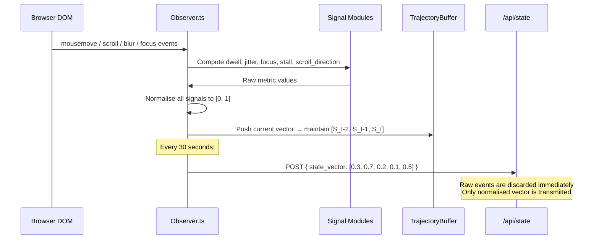
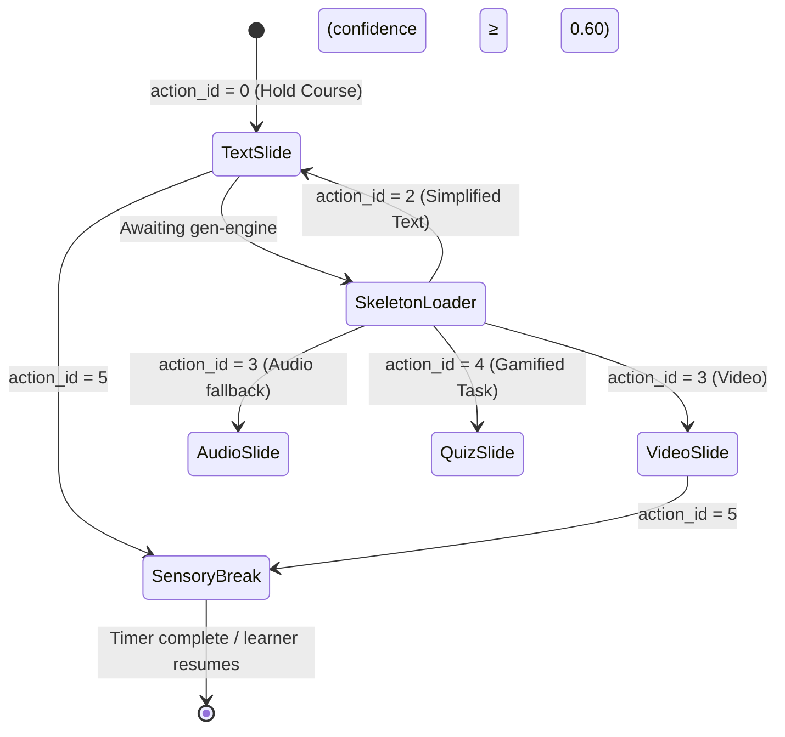

<div align="center">

# 🖥️ frontend
### Observer Layer · Student UI · Educator Dashboard

*The learner's window into NeuroAdapt — and the system's window into the learner.*

[](https://nextjs.org)
[](https://typescriptlang.org)
[](https://tailwindcss.com)
[](https://www.w3.org/WAI/WCAG21/quickref/)

> **Primary Owner:** Prarthana Upadhyaya
> **Supports:** Sudarshan (Observer endpoint), Varun (Content Renderer)

</div>

---

## 🎯 Responsibility

The `frontend/` module owns three distinct concerns:

1. **The Observer** — passive telemetry engine that runs in the browser, computes all five cognitive signals locally, and posts only normalised vectors to the backend. No raw data ever leaves the device.
2. **The Student Interface** — lesson renderer, Energy Bar, Preference Delta modal, and Micro-Feedback widget.
3. **The Educator Dashboard** — aggregated, anonymised cohort insights (≥5 students per view).

---

## 🗂️ Directory Layout

```
frontend/
├── public/
│   └── assets/
│       ├── calm-break-bg.svg       # Sensory break screen — minimal, no visual noise
│       └── icons/
│
├── src/
│   ├── app/                        # Next.js 14 App Router
│   │   ├── (student)/
│   │   │   ├── lesson/[moduleId]/  # Core learning session page
│   │   │   └── dashboard/          # Student progress view
│   │   ├── (educator)/
│   │   │   └── insights/           # Aggregated cohort heatmaps
│   │   ├── api/                    # Thin Next.js route handlers (proxy to FastAPI)
│   │   │   ├── state/route.ts
│   │   │   ├── action/route.ts
│   │   │   └── feedback/route.ts
│   │   └── layout.tsx
│   │
│   ├── components/
│   │   ├── observer/               # Telemetry — runs silently in the background
│   │   │   ├── Observer.ts
│   │   │   ├── signals/
│   │   │   │   ├── dwell.ts
│   │   │   │   ├── jitter.ts
│   │   │   │   ├── focus.ts
│   │   │   │   ├── stall.ts
│   │   │   │   └── scroll_direction.ts
│   │   │   └── TrajectoryBuffer.ts
│   │   ├── content/                # Content rendering — switches format per action
│   │   │   ├── ContentRenderer.tsx
│   │   │   ├── TextSlide.tsx
│   │   │   ├── VideoSlide.tsx
│   │   │   ├── AudioSlide.tsx
│   │   │   ├── QuizSlide.tsx
│   │   │   ├── SensoryBreak.tsx
│   │   │   └── SkeletonLoader.tsx
│   │   ├── feedback/               # Learner signals back to the Orchestrator
│   │   │   ├── EnergyBar.tsx
│   │   │   ├── PreferenceDeltaModal.tsx
│   │   │   └── MicroFeedback.tsx
│   │   ├── educator/               # Educator-only aggregated views
│   │   │   ├── EngagementHeatmap.tsx
│   │   │   ├── InterventionChart.tsx
│   │   │   └── FormatPrefDistribution.tsx
│   │   └── ui/                     # Atomic reusable components
│   │       ├── Button.tsx
│   │       ├── Badge.tsx
│   │       └── Tooltip.tsx
│   │
│   ├── hooks/
│   │   ├── useObserver.ts          # Mounts Observer, manages polling lifecycle
│   │   ├── useAction.ts            # Fetches action + handles offline fallback
│   │   └── useOfflineQueue.ts      # Queues state vectors when API is unreachable
│   │
│   └── lib/
│       ├── constants.ts            # ⚠️ AUTO-GENERATED — do not edit manually
│       ├── api.ts                  # Typed fetch wrappers for all backend endpoints
│       └── flesch_kincaid.ts       # Lightweight FK readability scorer (browser-side)
│
└── __tests__/
    ├── observer/
    └── components/
```

---

## 👁️ The Observer — How It Works

The Observer is the most privacy-critical component in the entire system. It computes all five signals **entirely on the client device** and transmits only a normalised 5-dimensional vector.



### The Five Signals

| Signal | Formula | Neurodivergent Relevance |
|---|---|---|
| **Semantic Dwell Ratio** | `time_on_slide / (word_count × fk_adjusted_read_time)` | Detects reading walls (dyslexia) and impulsive skimming (ADHD) |
| **Interaction Jitter** | `std_dev(mouse_velocity, last_10_samples)` | Proxy for anxiety and restlessness; touch fallback for mobile |
| **Focus Persistence** | `count(visibilityState == hidden, per_30s)` | Measures tab-switching frequency — primary ADHD inattention proxy |
| **Stall Duration** | `now() − last_interaction_timestamp` | Detects executive function paralysis |
| **Preference Delta** | `learner_selected_format (end-of-lesson modal)` | Ground truth — carried forward as prior for next session |

> ⚠️ **Cold Start:** In Session 1, `PD_prev` initialises to `0.5` (neutral prior). See [`backend/README.md`](../backend/README.md) for cold-start session handling.

---

## 🎨 Content Rendering — The Six States

`ContentRenderer.tsx` listens for `action_id` from the backend and conditionally renders the appropriate component. The transition between formats uses a **300ms CSS fade** — abrupt transitions are harmful for autism profiles.



> 💡 If `confidence < 0.60`, the `SkeletonLoader` is shown with a "thinking…" indicator instead of triggering a generative API call. This prevents unnecessary cost and avoids jarring transitions.

---

## 🔋 The Energy Bar

The Energy Bar is the learner's **sovereign override** — always visible, always accessible. Triggering it:

1. Immediately pauses the session and offers a break
2. Fires a **high-magnitude negative reward** (`-2.0`) to the Orchestrator via `POST /api/feedback`
3. Teaches the policy to intervene earlier in future sessions with similar signal trajectories

> 🔒 The Energy Bar **cannot** be removed or hidden by the institution. It is a non-negotiable learner right within the NeuroAdapt design philosophy.

---

## 📡 Offline Fallback

Indian connectivity is unreliable. When `/api/action` times out:

1. `useAction.ts` catches the timeout after **2 seconds**
2. Falls back to `action_id = 0` (Hold Course) — the safest default
3. `useOfflineQueue.ts` stores the current state vector in `localStorage`
4. On reconnection, queued vectors are batch-posted to the backend

The learner **never sees a broken session**. The session continues seamlessly.

---

## 🎓 Educator Dashboard

All educator views are aggregated. No individual student data is ever displayed. Minimum group size for any view: **5 students**.

| Widget | What It Shows |
|---|---|
| `EngagementHeatmap` | Per-slide stall frequency across the cohort |
| `InterventionChart` | Which module sections trigger the most format switches |
| `FormatPrefDistribution` | Text vs Video vs Audio vs Game preference split |

---

## 🧪 Running Tests

```bash
cd frontend
npm install
npm run test          # Jest + React Testing Library
npm run test:a11y     # axe-core accessibility audit
npm run lint          # ESLint + Prettier
```

---

## 🔗 Connected Modules

| Module | Connection |
|---|---|
| [`backend/`](../backend/README.md) | Receives state vectors via `POST /api/state` |
| [`backend/`](../backend/README.md) | Fetches actions via `GET /api/action` |
| [`gen-engine/`](../gen-engine/README.md) | Renders content produced by the synthesis engine |
| [`shared/`](../shared/README.md) | Imports `constants.ts` and TypeScript types |
| [`quantum/`](../quantum/README.md) | W&B Preference Delta chart embedded in admin panel |

---

<div align="center">

*Part of the [NeuroAdapt](../README.md) monorepo*
**👁️ The Observer sees what the platform would otherwise miss.**

</div>
