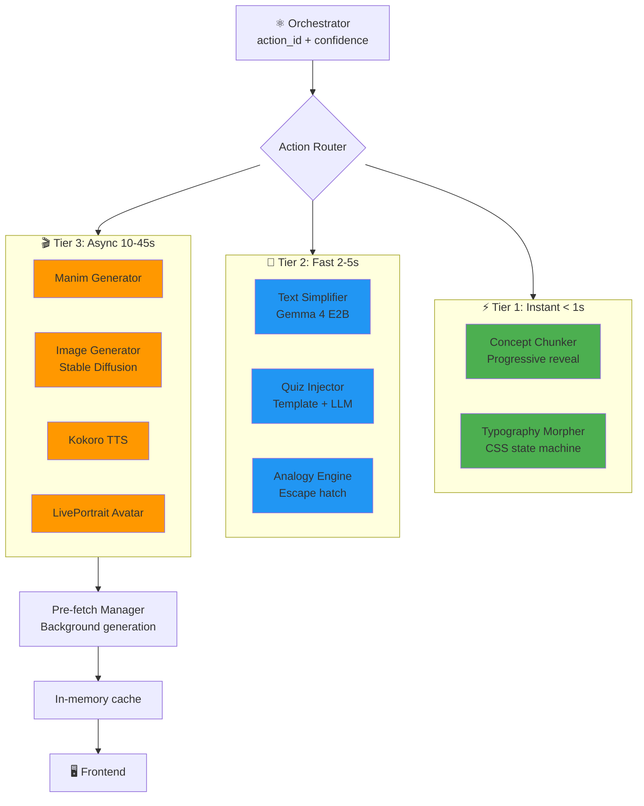
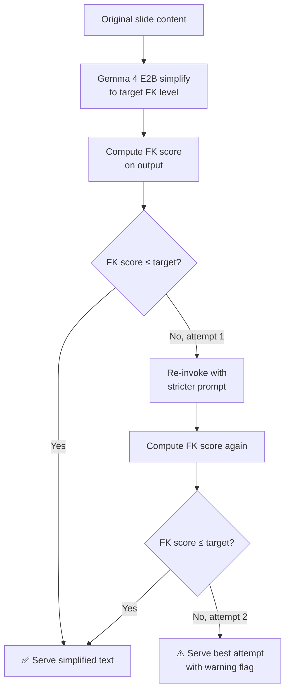
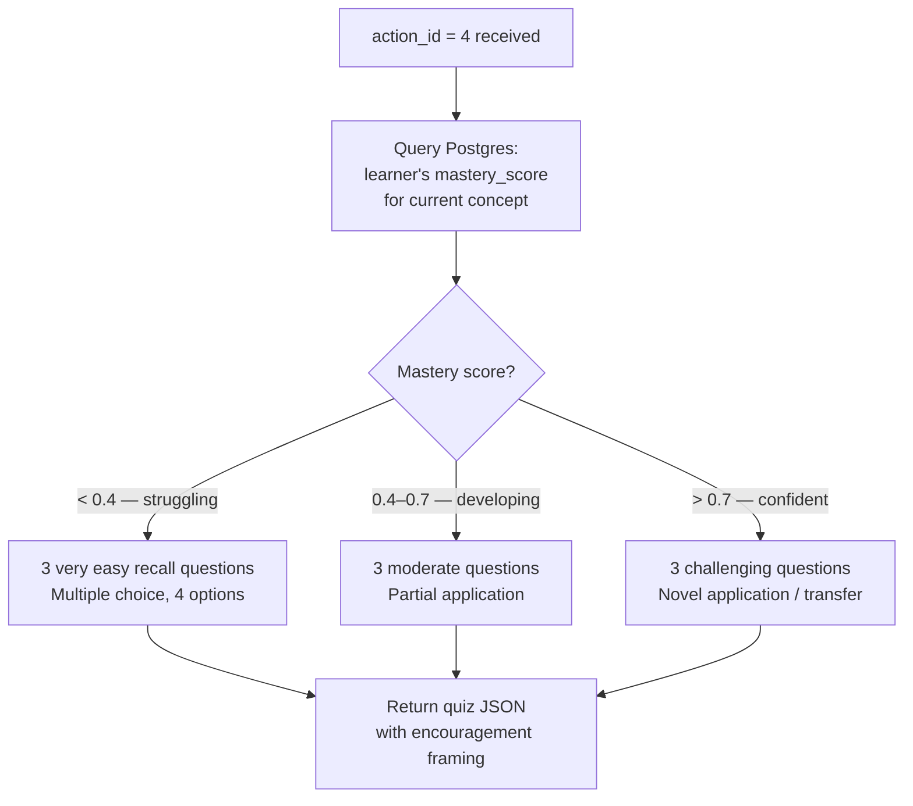
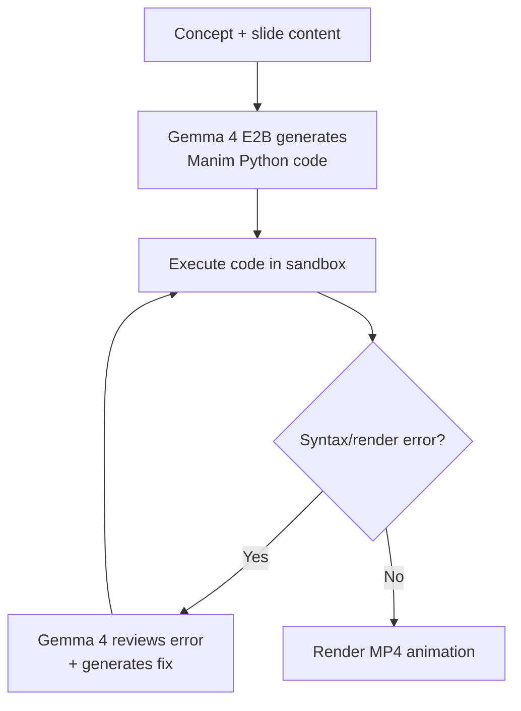

<div align="center">

# 🎨 gen-engine
### Generative Synthesis Engine — Text · Visual · Audio · Game

*Transforming content into whatever format the learner's brain needs right now.*

[](https://ai.google.dev/gemma)
[](https://www.manim.community/)
[](https://github.com/remsky/kokoro-fastapi)
[](https://github.com/KwaiVGI/LivePortrait)
[](https://fastapi.tiangolo.com)

> **Primary Owner:** Varun Aditya
> **Supports:** Prarthana (ContentRenderer integration) · Sudarshan (confidence gate)

</div>

---

## 🎯 Responsibility

The `gen-engine/` module is an independent FastAPI microservice that executes the content interventions decided by the Orchestrator. It has **no policy of its own** — it does not decide what to produce. Given an `action_id` and the current slide content, it produces the best possible version of that content in the target format.

Key responsibilities:
- **Text simplification** with Flesch-Kincaid verification
- **STEM animation generation** with Manim for abstract concepts
- **Visual synthesis** with autism-safe content constraints
- **Calm-preset audio** generation with voice cloning
- **Avatar video creation** with lip-sync narration
- **Mastery-scaled gamified tasks**
- **Analogy generation** as escape hatch for complex concepts
- **Typography morphing** based on cognitive state
- **Hyperfocus protection** to preserve productive focus states
- **Async pre-fetching** of the next likely format before the learner needs it

---

## 🗂️ Directory Layout

```
gen-engine/
├── main.py                          # FastAPI entry point
├── requirements.txt                 # All dependencies pinned
├── Dockerfile                       # Production container
├── docker-compose.yml               # Local dev stack
│
├── routers/
│   ├── generate.py                  # POST /api/generate — action dispatcher
│   └── health.py                    # GET /health — readiness probe
│
├── generators/
│   ├── text_simplify.py            # Gemma 4 E2B + FK verification loop (Tier 2)
│   ├── quiz_injector.py            # Template + LLM hybrid MCQ (Tier 2)
│   ├── analogy_engine.py           # Escape hatch: 3 analogies on-demand (Tier 2)
│   ├── manim_gen.py                # Writer-Reviewer Manim loop (Tier 3)
│   ├── image_gen.py                # SD 1.5 + autism-safe constraints (Tier 3)
│   ├── kokoro_tts.py               # Kokoro Docker wrapper + voice cloning (Tier 3)
│   ├── liveportrait_avatar.py      # Audio → lip-sync video (Tier 3)
│   ├── chunk_renderer.py           # Progressive text reveal (Tier 1)
│   └── typography_morpher.py       # CSS state machine (Tier 1)
│
├── orchestration/
│   ├── action_router.py            # Tier classification + dispatch logic
│   ├── hyperfocus_gate.py          # Pre-emption: protect hyperfocus states
│   ├── prefetch_manager.py         # Async background generation
│   └── latency_budget.py           # Per-modality timeouts + fallback chain
│
├── prompts/
│   ├── simplify_grade5.txt         # Few-shot FK ≤ 6.0
│   ├── simplify_grade8.txt         # Few-shot FK ≤ 9.0
│   ├── simplify_university.txt     # Few-shot FK ≤ 13.0
│   ├── manim_expert.txt            # Manim code generation system prompt
│   ├── manim_reviewer.txt          # Error correction reviewer prompt
│   ├── analogy_generator.txt       # 3-analogy escape hatch prompt
│   └── image_gen_base.txt          # SD base prompt + autism-safe negative block
│
├── models/
│   ├── request_schemas.py          # Pydantic input validation
│   └── response_schemas.py         # Pydantic output serialization
│
└── __tests__/
    ├── test_text_simplify.py       # FK score verification
    ├── test_manim_loop.py          # Writer-Reviewer error recovery
    ├── test_prefetch.py            # Latency budget enforcement
    └── test_hyperfocus.py          # Pre-emption gate logic
```

---

## 🏗️ Architecture Overview



---

## 🔄 Request Flow

```mermaid
sequenceDiagram
    participant OR as Orchestrator
    participant BE as Backend
    participant GE as gen-engine
    participant LLM as Gemma 4 E2B (Ollama)
    participant SD as Stable Diffusion
    participant TTS as Kokoro TTS

    OR->>BE: action_id=2, confidence=0.74
    BE->>GE: POST /api/generate
{action_id, slide_content, learner_level}
    GE->>GE: Route by action_id

    alt action_id = 2 (Simplify Text)
        GE->>LLM: Simplify to Grade 8 level
        LLM->>GE: Simplified text
        GE->>GE: FK score check ≥ target?
        GE->>LLM: Re-try with stricter prompt if needed
        GE->>BE: Simplified text (verified)
    else action_id = 3 (STEM Video)
        GE->>LLM: Generate Manim code for concept
        GE->>GE: Manim render to MP4
        GE->>TTS: Generate calm narration WAV
        GE->>BE: {video_url, audio_url}
    else action_id = 4 (Gamified Task)
        GE->>GE: quiz_injector — mastery-scaled MCQ
        GE->>BE: {quiz_json}
    end
```

---

## ✍️ Text Simplification — The FK Verification Loop

Simply calling an LLM with "simplify this" is insufficient. The output must be **verified** to meet the target reading level before being served.



**Three reading levels with few-shot prompt templates:**

| Level | Target FK Grade | Use Case |
|---|---|---|
| `grade5` | ≤ 6.0 | Severe reading difficulty, early session, high overload |
| `grade8` | ≤ 9.0 | Moderate simplification, default for most interventions |
| `university` | ≤ 13.0 | Light restructuring only (bullets, shorter sentences) |

> ⚠️ Simplification **never changes the conceptual content** — only the linguistic presentation. A chemistry equation remains a chemistry equation; only the surrounding explanation is simplified.

---

## 🖼️ Image Generation — Autism-Safe Constraints

Stable Diffusion's default outputs are unpredictable. For neurodivergent learners — especially autism profiles with sensory sensitivities — unconstrained image generation can produce stimuli that are actively harmful.

Every image generation call in NeuroAdapt includes a **mandatory negative prompt block**:

```
negative_prompt: "high contrast, cluttered, busy background, 
neon colours, flashing elements, multiple faces, 
photorealistic crowds, chaotic composition, 
sharp geometric patterns, intense shadows"
```

The base positive prompt template (from `prompts/image_gen_base.txt`) emphasises:
- **Soft, muted colour palettes**
- **Simple, clean compositions with one focal element**
- **Flat or watercolour illustration style** (not photorealistic)
- **Generous white/negative space**

---

## 🔊 Audio Generation — The Calm Preset

`kokoro_tts.py` wraps Kokoro TTS with a fixed preset optimised for neurodivergent learners:

| Parameter | Value | Reason |
|---|---|---|
| Voice | Gender-neutral, warm | Reduces social processing load |
| Speaking rate | 0.85× default | Allows more time for processing |
| Prosodic variation | Minimal | Sudden emphasis can be overstimulating |
| Background music | None | Zero competing auditory stimuli |
| Sentence pause | +20% longer | Executive function needs transition time |

**Voice Cloning:** 10-second sample → cloned voice for familiarity.  
**Fallback chain:** Kokoro TTS (local, free) → Web Speech API (browser native) → text-only.

---

## 🎮 Gamified Task Injector — Mastery-Scaled Difficulty

Action 4 injects a short, engaging task burst. Unlike a standard quiz, the difficulty is **not** based on the static content level — it is based on the **learner's demonstrated mastery of the current concept** from Postgres.



> 🎯 Correct answers to the gamified task update the `mastery_score` in Postgres, which feeds back into future difficulty calibration.

---

## 🎬 Manim Animation Generation — STEM Concept Visualization

For abstract STEM concepts (math, physics, algorithms), static images fail. Manim generates **pedagogy-aware animations** that show the concept dynamically.

**Writer-Reviewer Loop:**


**Research-Backed:** LLM2Manim (2026) shows animations improve learning gains by d=0.67 vs. static slides, especially for low-prior-knowledge learners.

---

## 🧠 Analogy Engine — Escape Hatch for Complex Concepts

When direct simplification fails, generate **3 analogies** to explain the concept through familiar domains.

**Example:** For "Neural Networks" →  
1. **Brain Analogy:** Like neurons firing in your brain  
2. **Traffic Analogy:** Cars routing through intersections  
3. **Recipe Analogy:** Ingredients combining to make a dish

**Research:** Analogies improve problem-solving success from 10% to 80% with multiple examples (Gick & Holyoak, 1980s).

---

## 🛡️ Hyperfocus Protective Gate

Rare ADHD hyperfocus states are **protected** — no interventions when `hyperfocus_composite > 0.75`.

**Mechanism:** Pre-emption check overrides Orchestrator to `action_id = 0`, blocks UI changes.

**Research:** Hyperfocus enhances productivity/creativity; protecting it preserves flow (Russell Barkley, Nadeau studies).

---

## ⚡ Async Pre-Fetching

The pre-fetch manager is what makes NeuroAdapt feel **instantaneous** to the learner. It begins generating the next content variants **before** the Orchestrator makes its final decision.

```mermaid
sequenceDiagram
    participant OB as Observer (30s interval)
    participant OR as Orchestrator
    participant PF as Prefetch Manager
    participant GE as Generators

    OB->>OR: State vector posted
    OR->>OR: Compute Q-values for all 6 actions
    OR->>PF: Top-2 actions by Q-value
(async, non-blocking)
    PF->>GE: Begin generating action_1 variant
    PF->>GE: Begin generating action_2 variant
    OR->>OR: Make final decision (30s later)
    OR->>PF: Confirmed action_id
    PF->>PF: Cancel non-selected generation
    PF-->>Frontend: Serve pre-generated content
(appears instantaneous)
```

---

## ⏱️ Latency Budgets

`latency_budget.py` enforces hard timeouts per modality. If a generation exceeds its budget, the system **falls back gracefully** — serving original content with a soft visual indicator rather than blocking the learner.

| Modality | Target | Hard Timeout | Fallback |
|---|---|---|---|
| Text simplification (Groq/Ollama) | best effort | 450s | Serve original text |
| Analogy generation (Gemma 4 E2B) | < 2s | 3s | Skip analogy |
| Audio TTS (Kokoro) | best effort | 120s | Serve text only |
| Image generation (Stable Diffusion) | best effort | 60s | Serve text + audio |
| Manim animation (local render) | best effort | 600s | Serve static image + audio |
| LivePortrait avatar (local) | < 15s | 20s | Serve illustrated narrative |

---

## 🧾 Runtime Metadata (Degradation + Transparency)

When fallback/degradation happens, payloads may include explicit metadata so downstream UI and logs can stay truthful:

| Field | Meaning | Example |
|---|---|---|
| `generation_mode` | Runtime generation path used | `sd_generated`, `svg_fallback`, `text_fallback` |
| `fallback_stage` | Specific degradation stage identifier | `text_simplify_timeout`, `image_diffusion_failure` |
| `safety_prompt_applied` | Whether autism-safe prompt constraints were applied | `true` |
| `safety_verified` | Whether explicit post-generation safety verification actually ran | `false` |
| `safety_verification_method` | Safety verification method used | `prompt_only`, `not_performed` |
| `timestamp_confidence` | Confidence level for TTS word timestamps | `high`, `heuristic` |

For prefetch-heavy requests, wait tuning can be adjusted via env vars:
- `PREFETCH_WAIT_SECONDS` (global baseline)
- `PREFETCH_WAIT_SECONDS_ACTION3` (heavier visual/audio path)
- `PREFETCH_WAIT_SECONDS_ACTION4` (quiz path)

Prefetch cache matching uses:
- `session_id`
- `action_id`
- `learner_level`
- normalized `content_type` (with `auto` alias fallback)
- hash of `slide_content`

---

## 💰 The Cost Gate

`/api/generate` is only called when `confidence ≥ 0.60`. In well-matched sessions (learner is in flow), most 30-second intervals result in `action_id = 0` — no API calls, zero cost.

**Open-source substitution map (zero-cost deployment):**

| Paid Component | Free Substitute | Quality Trade-off |
|---|---|---|
| OpenAI GPT-4o | Gemma 4 E2B via Ollama | Better multimodal, Apache 2.0 |
| HeyGen avatar | LivePortrait (local) | Higher quality lip-sync |
| ElevenLabs TTS | Kokoro TTS (local) | Voice cloning included |
| Stable Diffusion API | SD local via `diffusers` | Slower (CPU-only if no GPU) |

---

## 🧪 Running Tests

```bash
cd gen-engine
pip install -r requirements.txt

# Run all tests
pytest __tests__/ -v

# Test FK verification specifically
pytest __tests__/test_text_simplify.py -v -k "test_fk_verification"

# Test latency budget enforcement
pytest __tests__/test_prefetch.py -v -k "test_timeout_fallback"
```

---

## 📚 API Reference

### `POST /api/generate`

Generate content in target format based on `action_id`.

**Request:**
```json
{
  "action_id": 2,
    "slide_content": "Photosynthesis is the process by which plants convert light energy into chemical energy.",
    "learner_level": "grade8"
}
```

Strict contract:
- Required fields only: `action_id`, `slide_content`, `learner_level`
- Unknown fields are rejected (`422`)

**Response (action_id = 2 — Text Simplification):**
```json
{
  "action_id": 2,
  "content": {
    "simplified_text": "Plants make their own food using sunlight...",
    "fk_grade": 7.8,
    "original_fk": 12.3,
        "chunks": [
            {
                "text": "Plants make their own food using sunlight.",
                "readability_grade": 6.4,
                "word_count": 7
            }
        ]
    }
}
```

**Response (degraded timeout example):**
```json
{
    "action_id": 2,
    "content": {
        "simplified_text": "<original text>"
    }
}
```

**Supported action_ids:**
- `0`: Hold (no generation, returns 204)
- `1`: Nudge (chunked reading mode, Tier 1)
- `2`: Simplify (Tier 2)
- `3`: Video (multimodal: image/animation/audio/avatar, Tier 3)
- `4`: Game (gamified quiz, Tier 2)
- `5`: Break (sensory reset template, Tier 1)

Status codes:
- `200`: Content generated
- `204`: No content branch (`action_id=0` or hyperfocus protection)
- `422`: Validation failure
- `500`: Internal generation/routing failure

### `POST /api/prefetch`

Queue speculative generation for top candidates.

```json
{
    "session_id": "550e8400-e29b-41d4-a716-446655440000",
    "top_actions": [3, 2],
    "slide_content": "Newton's first law states that an object stays in motion unless acted on by a force.",
    "learner_level": "grade8"
}
```

Strict contract:
- Required: `session_id`, `top_actions`, `slide_content`
- Optional: `learner_level`
- Unknown fields are rejected (`422`)

### `GET /api/prefetch/status`

Read prefetch readiness for a specific action/content tuple.

Query params:
- `action_id` (required)
- `session_id` (required)
- `slide_content` (required)
- `content_type` (optional)
- `learner_level` (optional, default `grade8`)

```json
{
    "status": "ready",
    "cache_hit": true,
    "content": {
        "video_url": "/tmp/animations/newton.mp4"
    },
    "action_id": 3,
    "session_id": "550e8400-e29b-41d4-a716-446655440000"
}
```

`status` values: `ready`, `pending`, `missing`.

### `GET /health`

Dependency checks are refreshed with throttling and include recency metadata:

```json
{
    "status": "healthy",
    "services": {
        "Ollama": {
            "status": "up",
            "last_check": "2026-04-19T10:25:11.123456",
            "checked_seconds_ago": 0.42,
            "error": null
        }
    }
}
```

---

## 🔗 Connected Modules

| Module | Connection |
|---|---|
| [`backend/`](../backend/README.md) | Receives generation requests via `/api/generate` |
| [`quantum/`](../quantum/README.md) | Confidence gate set by Orchestrator Q-values |
| [`frontend/`](../frontend/README.md) | Delivers generated content to `ContentRenderer.tsx` |
| [`infra/`](../infra/README.md) | Containerised as independent Docker service |

---

## 🚀 Setup & Development

### Prerequisites
- Python 3.11+
- Docker & Docker Compose
- Ollama installed locally

### Quick Start
```bash
# Install all dependencies
pip install -r requirements.txt

# Start Ollama + Gemma 4 E2B model
ollama serve &
ollama pull gemma4:e2b  # or your chosen Gemma 4 variant

# Install Manim (Community edition)
pip install manim

# Install Kokoro TTS (Docker-based)
docker pull ghcr.io/hexgrad/kokoro-tts:latest

# Install LivePortrait (GitHub repo)
git clone https://github.com/KwaiVGI/LivePortrait
cd LivePortrait && pip install -r requirements.txt

# Run gen-engine locally
uvicorn main:app --reload --host 0.0.0.0 --port 8001
```

### Docker Development
```bash
# Full stack with all services
docker-compose up -d

# Includes: gen-engine, Kokoro TTS, Ollama, Prometheus
```

---

<div align="center">

*Part of the [NeuroAdapt](../README.md) monorepo*
**🎨 The right content, in the right format, at the right moment — every time.**

</div>
