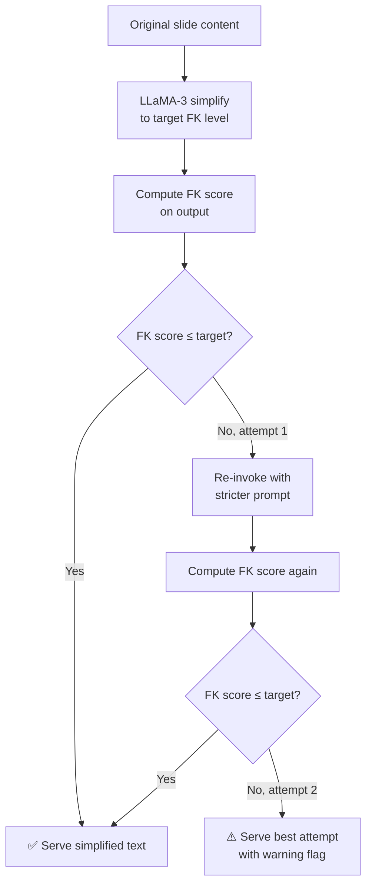
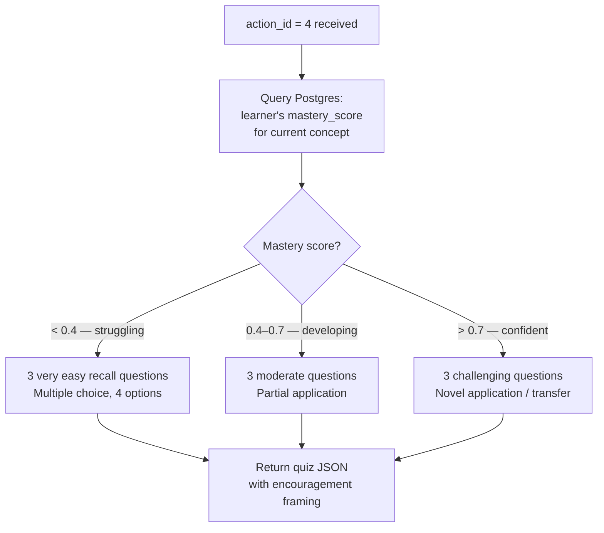

<div align="center">

# 🎨 gen-engine
### Generative Synthesis Engine — Text · Visual · Audio · Game

*Transforming content into whatever format the learner's brain needs right now.*

[](https://ollama.com)
[](https://stability.ai)
[](https://coqui.ai)
[](https://fastapi.tiangolo.com)

> **Primary Owner:** Varun Aditya
> **Supports:** Prarthana (ContentRenderer integration) · Sudarshan (confidence gate)

</div>

---

## 🎯 Responsibility

The `gen-engine/` module is an independent FastAPI microservice that executes the content interventions decided by the Orchestrator. It has **no policy of its own** — it does not decide what to produce. Given an `action_id` and the current slide content, it produces the best possible version of that content in the target format.

Key responsibilities:
- **Text simplification** with Flesch-Kincaid verification
- **Visual synthesis** with autism-safe content constraints
- **Calm-preset audio** generation
- **Mastery-scaled gamified tasks**
- **Async pre-fetching** of the next likely format before the learner needs it

---

## 🗂️ Directory Layout

```
gen-engine/
├── main.py                     # FastAPI entry for generation service
├── routers/
│   └── generate.py             # POST /api/generate — dispatches by action_id
│
├── generators/
│   ├── text_simplify.py        # LLaMA-3 rewriter + FK verification loop
│   ├── image_gen.py            # Stable Diffusion + autism-safe negative prompts
│   ├── tts.py                  # Coqui TTS calm preset wrapper
│   ├── quiz_injector.py        # Gamified task builder (mastery-scaled difficulty)
│   └── avatar_video.py         # HeyGen API wrapper (optional / premium tier)
│
├── prefetch/
│   ├── prefetch_manager.py     # Async background generation of top-N format variants
│   └── latency_budget.py       # Per-modality timeout config + graceful fallback
│
├── prompts/
│   ├── simplify_grade5.txt     # Few-shot prompt templates by reading level
│   ├── simplify_grade8.txt
│   ├── simplify_university.txt
│   └── image_gen_base.txt      # Base Stable Diffusion prompt + negative block
│
└── __tests__/
    ├── test_text_simplify.py   # FK score verification of outputs
    ├── test_quiz_injector.py
    └── test_prefetch.py        # Latency budget enforcement
```

---

## 🔄 Request Flow

```mermaid
sequenceDiagram
    participant OR as Orchestrator
    participant BE as Backend
    participant GE as gen-engine
    participant LLM as LLaMA-3 (Ollama)
    participant SD as Stable Diffusion
    participant TTS as Coqui TTS

    OR->>BE: action_id=2, confidence=0.74
    BE->>GE: POST /api/generate
{action_id, slide_content, learner_level}
    GE->>GE: Route by action_id

    alt action_id = 2 (Simplify Text)
        GE->>LLM: Simplify to Grade 8 level
        LLM->>GE: Simplified text
        GE->>GE: FK score check ≥ target?
        GE->>LLM: Re-try with stricter prompt if needed
        GE->>BE: Simplified text (verified)
    else action_id = 3 (Video)
        GE->>SD: Generate illustration sequence
        GE->>TTS: Generate calm narration WAV
        GE->>BE: {images[], audio_url}
    else action_id = 4 (Gamified Task)
        GE->>GE: quiz_injector — mastery-scaled MCQ
        GE->>BE: {quiz_json}
    end
```

---

## ✍️ Text Simplification — The FK Verification Loop

Simply calling an LLM with "simplify this" is insufficient. The output must be **verified** to meet the target reading level before being served.



**Three reading levels with few-shot prompt templates:**

| Level | Target FK Grade | Use Case |
|---|---|---|
| `grade5` | ≤ 6.0 | Severe reading difficulty, early session, high overload |
| `grade8` | ≤ 9.0 | Moderate simplification, default for most interventions |
| `university` | ≤ 13.0 | Light restructuring only (bullets, shorter sentences) |

> ⚠️ Simplification **never changes the conceptual content** — only the linguistic presentation. A chemistry equation remains a chemistry equation; only the surrounding explanation is simplified.

---

## 🖼️ Image Generation — Autism-Safe Constraints

Stable Diffusion's default outputs are unpredictable. For neurodivergent learners — especially autism profiles with sensory sensitivities — unconstrained image generation can produce stimuli that are actively harmful.

Every image generation call in NeuroAdapt includes a **mandatory negative prompt block**:

```
negative_prompt: "high contrast, cluttered, busy background, 
neon colours, flashing elements, multiple faces, 
photorealistic crowds, chaotic composition, 
sharp geometric patterns, intense shadows"
```

The base positive prompt template (from `prompts/image_gen_base.txt`) emphasises:
- **Soft, muted colour palettes**
- **Simple, clean compositions with one focal element**
- **Flat or watercolour illustration style** (not photorealistic)
- **Generous white/negative space**

---

## 🔊 Audio Generation — The Calm Preset

`tts.py` wraps Coqui TTS with a fixed preset optimised for neurodivergent learners:

| Parameter | Value | Reason |
|---|---|---|
| Voice | Gender-neutral, warm | Reduces social processing load |
| Speaking rate | 0.85× default | Allows more time for processing |
| Prosodic variation | Minimal | Sudden emphasis can be overstimulating |
| Background music | None | Zero competing auditory stimuli |
| Sentence pause | +20% longer | Executive function needs transition time |

**Fallback chain:** Coqui TTS (local, free) → ElevenLabs (cloud, premium) → Web Speech API (browser native).

---

## 🎮 Gamified Task Injector — Mastery-Scaled Difficulty

Action 4 injects a short, engaging task burst. Unlike a standard quiz, the difficulty is **not** based on the static content level — it is based on the **learner's demonstrated mastery of the current concept** from Postgres.



> 🎯 Correct answers to the gamified task update the `mastery_score` in Postgres, which feeds back into future difficulty calibration.

---

## ⚡ Async Pre-Fetching

The pre-fetch manager is what makes NeuroAdapt feel **instantaneous** to the learner. It begins generating the next content variants **before** the Orchestrator makes its final decision.

```mermaid
sequenceDiagram
    participant OB as Observer (30s interval)
    participant OR as Orchestrator
    participant PF as Prefetch Manager
    participant GE as Generators

    OB->>OR: State vector posted
    OR->>OR: Compute Q-values for all 6 actions
    OR->>PF: Top-2 actions by Q-value
(async, non-blocking)
    PF->>GE: Begin generating action_1 variant
    PF->>GE: Begin generating action_2 variant
    OR->>OR: Make final decision (30s later)
    OR->>PF: Confirmed action_id
    PF->>PF: Cancel non-selected generation
    PF-->>Frontend: Serve pre-generated content
(appears instantaneous)
```

---

## ⏱️ Latency Budgets

`latency_budget.py` enforces hard timeouts per modality. If a generation exceeds its budget, the system **falls back gracefully** — serving original content with a soft visual indicator rather than blocking the learner.

| Modality | Target | Hard Timeout | Fallback |
|---|---|---|---|
| Text simplification (LLaMA-3 local) | < 3s | 5s | Serve original text |
| Audio TTS (Coqui) | < 2s | 3s | Serve text only |
| Image generation (Stable Diffusion) | < 8s | 12s | Serve text + audio |
| Avatar video (HeyGen) | < 15s | 20s | Serve illustrated narrative |

---

## 💰 The Cost Gate

`/api/generate` is only called when `confidence ≥ 0.60`. In well-matched sessions (learner is in flow), most 30-second intervals result in `action_id = 0` — no API calls, zero cost.

**Open-source substitution map (zero-cost deployment):**

| Paid Component | Free Substitute | Quality Trade-off |
|---|---|---|
| OpenAI GPT-4o | LLaMA-3 via Ollama | Slight drop in simplification quality |
| HeyGen avatar | D-ID / SadTalker (OSS) | Lower video quality |
| ElevenLabs TTS | Coqui TTS (local) | Slightly less natural voice |
| Stable Diffusion API | SD local via `diffusers` | Slower (CPU-only if no GPU) |

---

## 🧪 Running Tests

```bash
cd gen-engine
pip install -r requirements.txt

# Run all tests
pytest __tests__/ -v

# Test FK verification specifically
pytest __tests__/test_text_simplify.py -v -k "test_fk_verification"

# Test latency budget enforcement
pytest __tests__/test_prefetch.py -v -k "test_timeout_fallback"
```

---

## 🔗 Connected Modules

| Module | Connection |
|---|---|
| [`backend/`](../backend/README.md) | Receives generation requests via `/api/generate` |
| [`quantum/`](../quantum/README.md) | Confidence gate set by Orchestrator Q-values |
| [`frontend/`](../frontend/README.md) | Delivers generated content to `ContentRenderer.tsx` |
| [`infra/`](../infra/README.md) | Containerised as independent Docker service |

---

<div align="center">

*Part of the [NeuroAdapt](../README.md) monorepo*
**🎨 The right content, in the right format, at the right moment — every time.**

</div>
