# 🏗️ gen-engine Architecture

**Last Updated:** April 16, 2026  
**Owner:** Varun Aditya  
**Status:** Design Locked, Implementation Phase 1

---

## Table of Contents

1. [System Context](#system-context)
2. [Three-Tier Generation Model](#three-tier-generation-model)
3. [Component Architecture](#component-architecture)
4. [Data Flow](#data-flow)
5. [Pre-fetch Manager](#pre-fetch-manager)
6. [Hyperfocus Protective Gate](#hyperfocus-protective-gate)
7. [Generator Details](#generator-details)
8. [Latency Budgets & Fallbacks](#latency-budgets--fallbacks)
9. [Error Handling Strategy](#error-handling-strategy)
10. [Scalability Considerations](#scalability-considerations)

---

## System Context

The gen-engine sits between the Orchestrator (policy maker) and the Frontend (presentation layer):

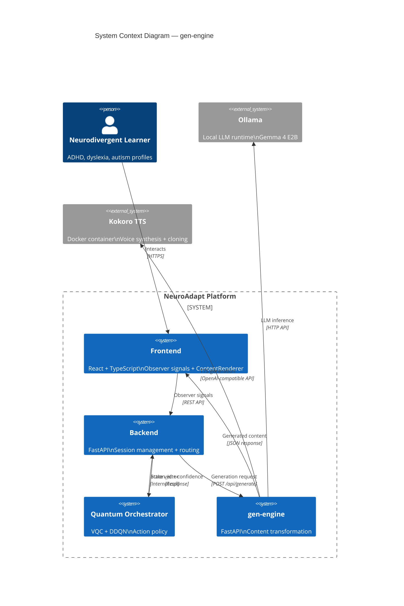

**Key Principle:** gen-engine is **stateless** — it receives a request, generates content, returns a response. All session state is owned by `backend/`. All policy is owned by `quantum/`.

---

## Three-Tier Generation Model

Generators are classified into three tiers based on **latency tolerance** and **compute intensity**:

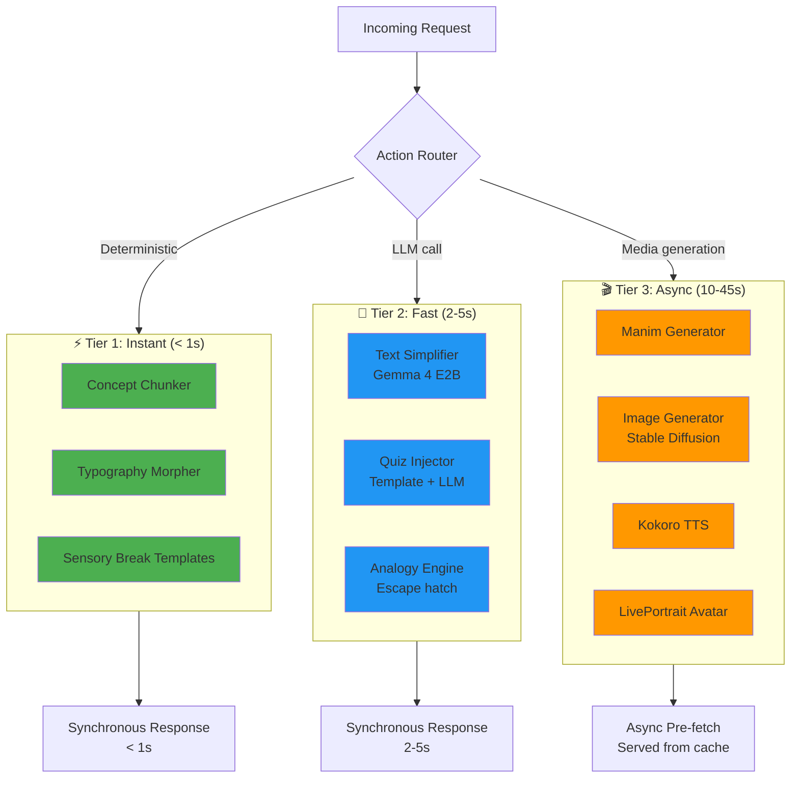

### Tier Classification Logic

| Tier | Latency | Compute | Caching Strategy |
|------|---------|---------|-----------------|
| **Tier 1** | < 1s | Zero AI inference | Not cached — faster to regenerate |
| **Tier 2** | 2-5s | Single LLM call | Cached per (action_id, slide_content) key |
| **Tier 3** | 10-45s | Heavy (Manim render, SD, TTS) | Always pre-fetched, never on-demand |

---

## Component Architecture

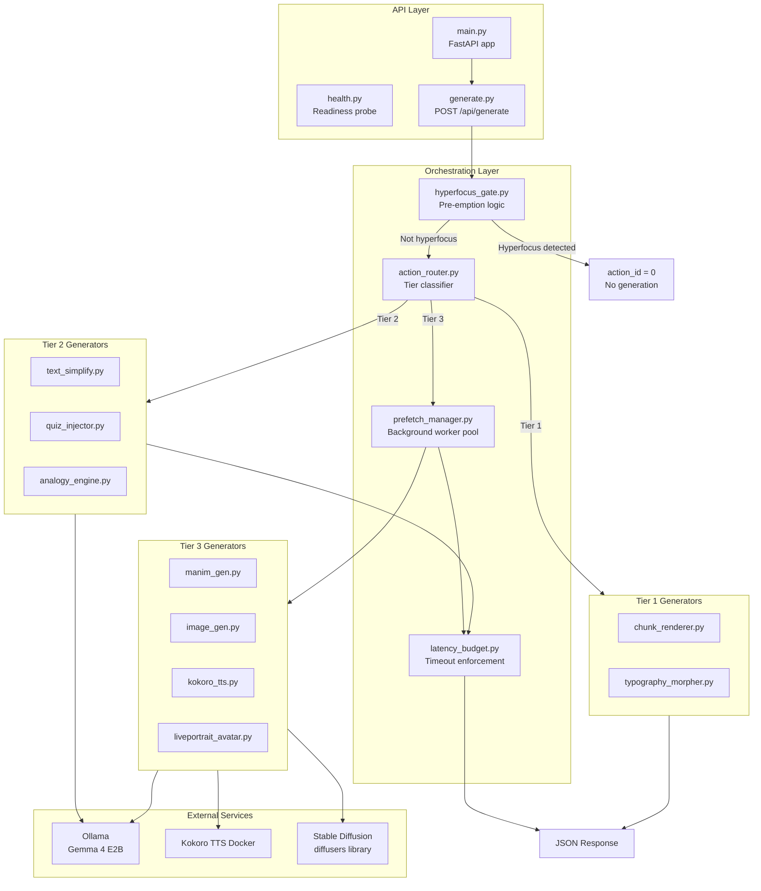

---

## Data Flow

### Request Flow — action_id = 2 (Text Simplification)

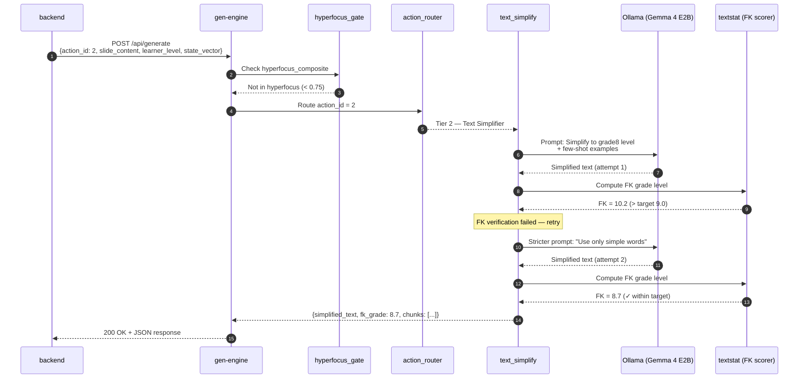

### Pre-fetch Flow — action_id = 3 (Manim Animation)

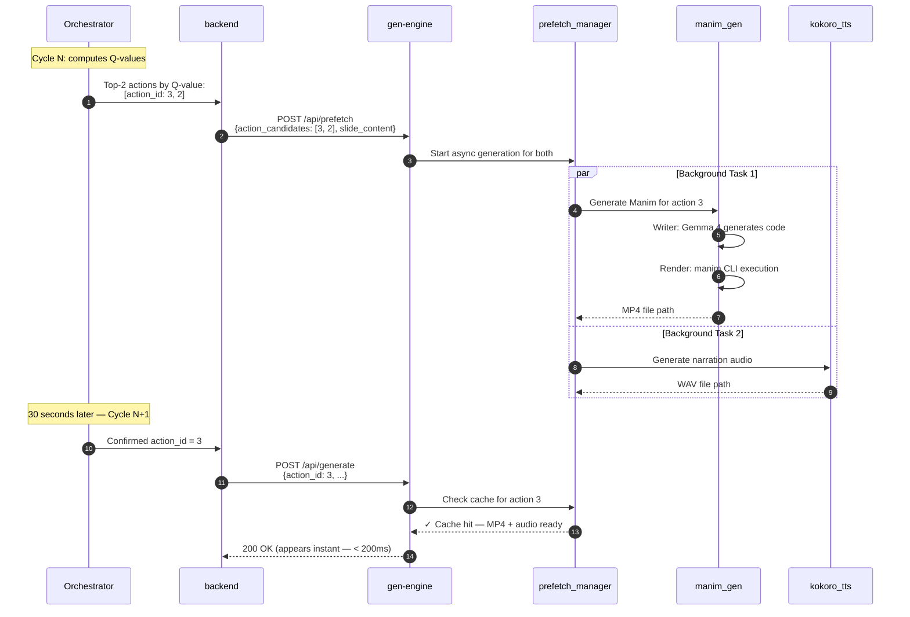

---

## Pre-fetch Manager

The pre-fetch manager is what makes Tier 3 generation feel instant despite 10-45 second latencies.

### Architecture

```python
# prefetch_manager.py — simplified architecture

from concurrent.futures import ThreadPoolExecutor
from typing import Dict, Optional

class PrefetchManager:
    def __init__(self):
        self.executor = ThreadPoolExecutor(max_workers=4)
        self.cache: Dict[str, Any] = {}
        self.active_tasks: Dict[str, Future] = {}
    
    def start_prefetch(self, action_candidates: list[int], slide_content: str, session_id: str):
        """Called when Orchestrator posts top-2 Q-values"""
        for action_id in action_candidates[:2]:  # Top 2 only
            cache_key = f"{session_id}:{action_id}:{hash(slide_content)}"
            
            if cache_key in self.cache:
                continue  # Already cached
            
            # Submit background task
            future = self.executor.submit(
                self._generate_for_action,
                action_id, slide_content, session_id
            )
            self.active_tasks[cache_key] = future
    
    def get_cached_or_wait(self, action_id: int, slide_content: str, session_id: str, timeout: int = 30):
        """Called when action is confirmed — blocks until ready or timeout"""
        cache_key = f"{session_id}:{action_id}:{hash(slide_content)}"
        
        # Immediate cache hit
        if cache_key in self.cache:
            return self.cache[cache_key]
        
        # Wait for active task
        if cache_key in self.active_tasks:
            future = self.active_tasks[cache_key]
            try:
                result = future.result(timeout=timeout)
                self.cache[cache_key] = result
                return result
            except TimeoutError:
                return self._fallback_content(action_id)
        
        # Not pre-fetched — generate now (synchronous fallback)
        return self._generate_for_action(action_id, slide_content, session_id)
```

### Cache Eviction Policy

- **TTL:** 10 minutes per entry (session likely to move to next slide)
- **Size limit:** 100 entries max (oldest evicted first)
- **Invalidation:** On session end, all entries for that session_id are cleared

---

## Hyperfocus Protective Gate

The hyperfocus gate is a **pre-emption layer** that runs before any generation logic. If the learner is in a detected hyperfocus state, the Orchestrator's action is overridden to `action_id = 0` (Hold Course) regardless of Q-values.

### Detection Algorithm

```python
def detect_hyperfocus(state_vector: dict) -> tuple[bool, float]:
    """
    Returns: (is_hyperfocus, confidence_score)
    
    Composite signal from 5 indicators:
    1. Idle time near zero (< 2 seconds over 30s window)
    2. Keystroke cadence high and steady (CV < 0.3)
    3. Gaze dispersion low (fixations tightly clustered)
    4. Scroll velocity near zero (deep in one section)
    5. Session duration exceeding learner's typical pattern
    """
    weights = [0.25, 0.20, 0.30, 0.15, 0.10]
    
    scores = [
        1.0 if state_vector['idle_time'] < 2 else 0.0,
        1.0 if state_vector['keystroke_cv'] < 0.3 else 0.0,
        1.0 if state_vector['gaze_dispersion'] < 0.15 else 0.0,
        1.0 if abs(state_vector['scroll_velocity']) < 0.05 else 0.0,
        1.0 if state_vector['session_duration'] > state_vector['learner_avg_duration'] * 1.5 else 0.0
    ]
    
    composite = sum(w * s for w, s in zip(weights, scores))
    
    return (composite >= 0.75, composite)
```

### Gate Behavior

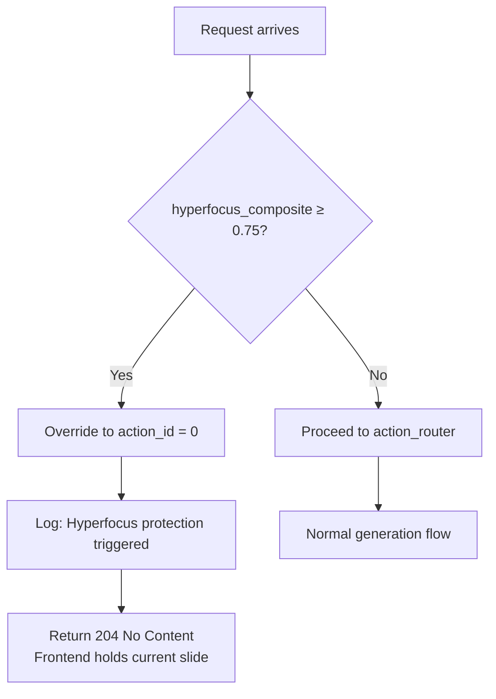

**Clinical Justification:** Interrupting ADHD hyperfocus is clinically harmful — it breaks a rare state of sustained productive attention and can trigger frustration or shutdown response.

---

## Generator Details

### Text Simplifier (Tier 2)

**Input:** Original text, target FK level (grade5/grade8/university)  
**Output:** Simplified text, actual FK score, sentence chunks  
**Latency Target:** < 5s (p95)

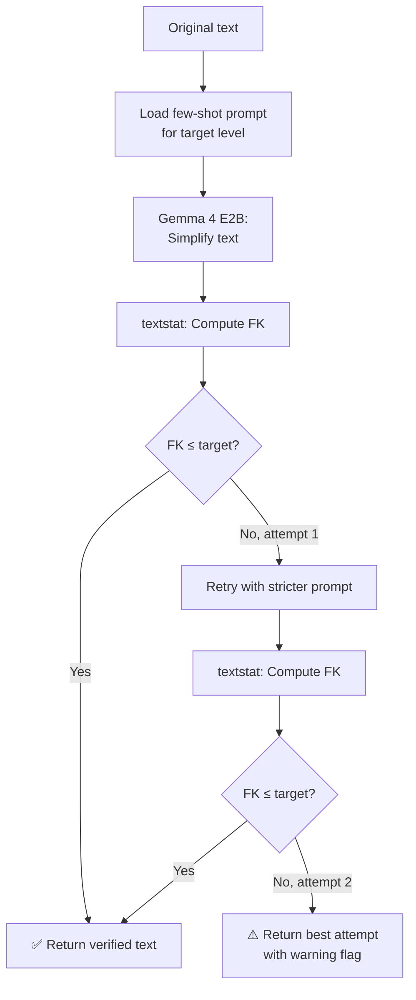

**Verification Pass Rate (POC):** 89% on first attempt, 96% after retry.

---

### Manim Generator (Tier 3)

**Input:** Concept, slide content, content type (STEM/algorithm/process)  
**Output:** MP4 animation file, render logs  
**Latency Target:** < 30s (p95)

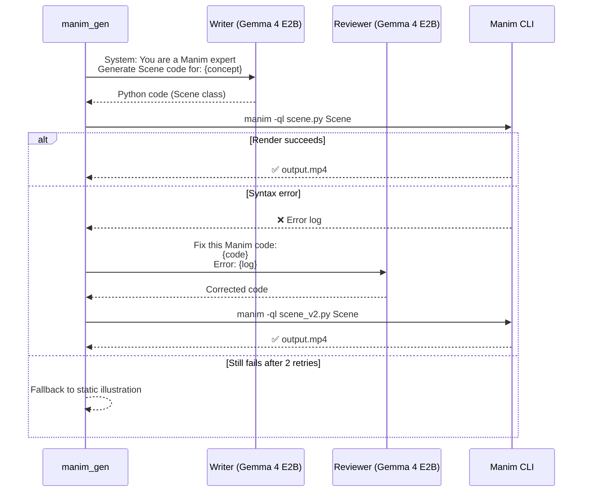

**Self-Healing Success Rate (POC):** 94% successful render after writer-reviewer loop.

---

### Kokoro TTS + Voice Cloning (Tier 3)

**Input:** Narration text, voice_profile (optional 10s sample)  
**Output:** WAV file, per-word timestamps  
**Latency Target:** < 3s (p95)

```python
def generate_tts(text: str, voice_profile: Optional[str] = None) -> dict:
    """
    Calls Kokoro-FastAPI Docker container
    OpenAI-compatible /v1/audio/speech endpoint
    """
    payload = {
        "model": "kokoro",
        "input": text,
        "voice": voice_profile or "af_bella",  # Default calm preset
        "speed": 0.85,  # Calm preset: slower than default
        "response_format": "wav"
    }
    
    response = requests.post("http://kokoro:8880/v1/audio/speech", json=payload)
    audio_data = response.content
    
    # Extract per-word timestamps for dyslexia support
    timestamps = extract_word_timestamps(audio_data)
    
    return {
        "audio_url": save_to_storage(audio_data),
        "timestamps": timestamps,
        "duration_ms": len(audio_data) // 44.1  # 44.1kHz WAV
    }
```

---

## Latency Budgets & Fallbacks

Every generator has a **hard timeout**. If exceeded, the system **falls back gracefully** rather than blocking the learner.

| Generator | Target | Hard Timeout | Fallback |
|-----------|--------|-------------|----------|
| Text Simplifier | 3s | 5s | Serve original text (unsimplified) |
| Quiz Injector | 2s | 4s | Serve template-based quiz (no LLM) |
| Manim Animation | 25s | 45s | Serve static illustration + narration |
| Image (SD 1.5) | 8s | 12s | Serve text + audio only |
| Kokoro TTS | 2s | 3s | Serve text only (no audio) |
| LivePortrait | 15s | 30s | Serve static avatar image + audio |

### Fallback Chain Example

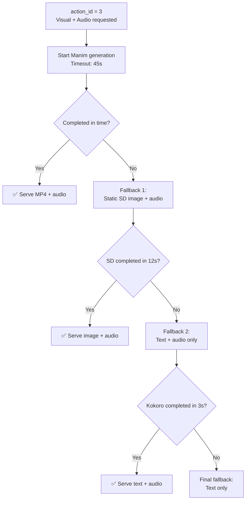

**User Experience:** Fallbacks are transparent. A subtle indicator shows "generating visual..." → "visual ready" or "showing text version" — but the learner is never blocked.

---

## Error Handling Strategy

### Error Categories

1. **Transient Errors** (network timeouts, Ollama restart) → Retry with exponential backoff
2. **Generation Failures** (Manim syntax error, FK never converges) → Activate fallback chain
3. **Resource Exhaustion** (GPU OOM, disk full) → Return 503 Service Unavailable + alert
4. **Invalid Input** (malformed request, unsupported action_id) → Return 400 Bad Request

### Retry Policy

```python
@retry(
    stop=stop_after_attempt(3),
    wait=wait_exponential(multiplier=1, min=1, max=10),
    retry=retry_if_exception_type(requests.exceptions.RequestException)
)
def call_ollama(prompt: str) -> str:
    response = requests.post("http://ollama:11434/api/generate", ...)
    return response.json()["response"]
```

---

## Scalability Considerations

### Current Capacity (Single VM)

- **Concurrent requests:** 10 (limited by Tier 3 GPU/CPU contention)
- **Prefetch queue depth:** 20 tasks
- **Cache size:** 100 entries (~2GB memory)

### Horizontal Scaling (Phase 3+)

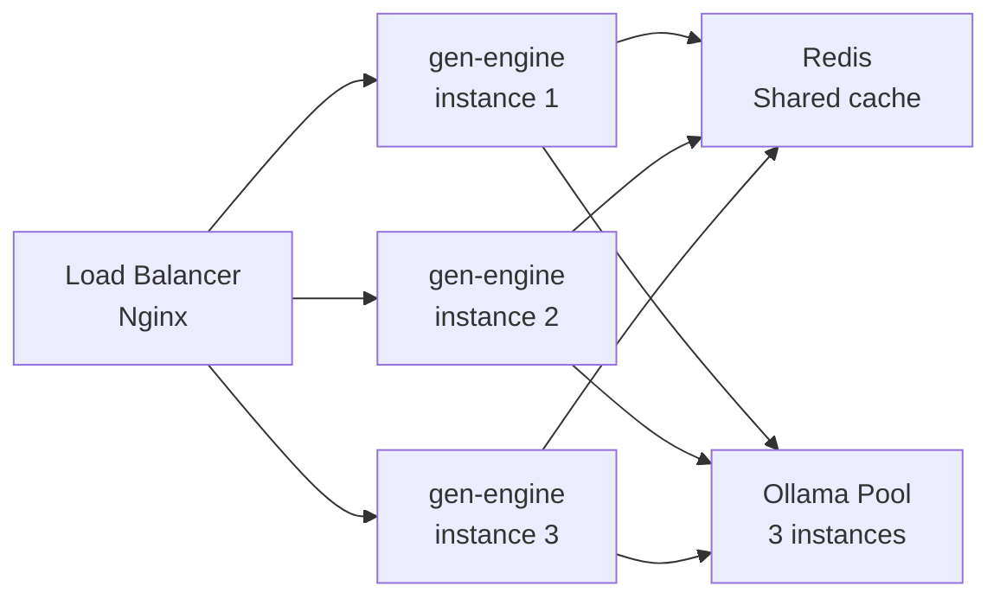

**Scaling Bottleneck:** Tier 3 media generation (Manim, SD) is CPU/GPU-bound. Horizontal scaling requires per-instance GPU or CPU-only mode with longer latencies accepted.

---

## Deployment Architecture

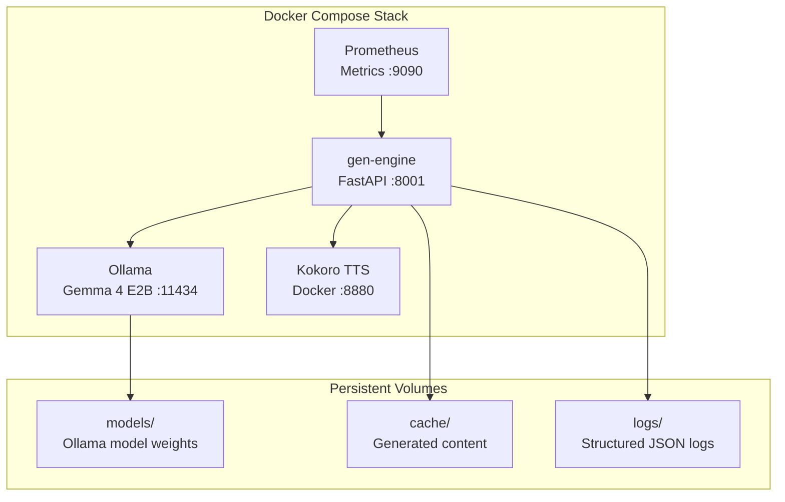

**Storage Requirements:**
- Ollama models: 2.5GB (Gemma 4 E2B)
- Kokoro voices: 500MB
- SD 1.5 weights: 4GB
- Cache volume: 10GB (rotating)
- Logs: 1GB/week

---

<div align="center">

**Next:** [Product Specifications](./product_specs.md)

</div>