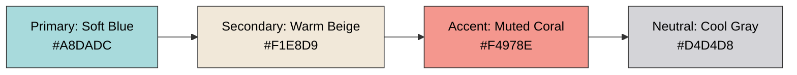
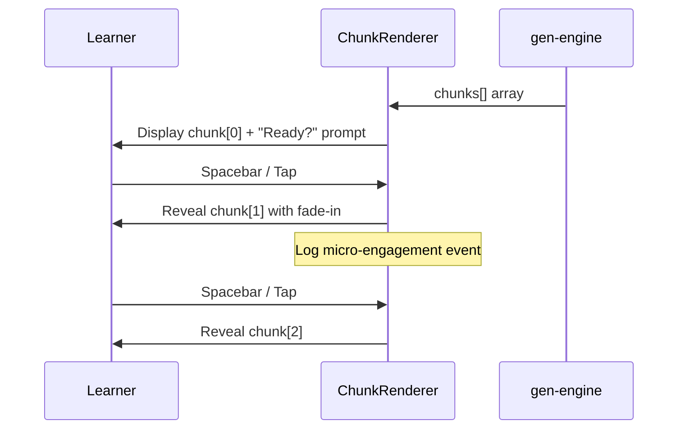

# 🎨 gen-engine Design System

**Version:** 1.0  
**Last Updated:** April 16, 2026  
**Owner:** Varun Aditya (gen-engine) + Prarthana (Frontend Integration)  
**Status:** Design Locked

---

## Table of Contents

1. [Design Philosophy](#design-philosophy)
2. [Typography Morphing States](#typography-morphing-states)
3. [Visual Content Constraints](#visual-content-constraints)
4. [Audio Design Specifications](#audio-design-specifications)
5. [Concept Chunking UI Patterns](#concept-chunking-ui-patterns)
6. [Hyperfocus Mode UI](#hyperfocus-mode-ui)
7. [Escape Hatch Analogy Carousel](#escape-hatch-analogy-carousel)
8. [Animation Principles](#animation-principles)
9. [Color Palette](#color-palette)
10. [Accessibility Standards](#accessibility-standards)

---

## Design Philosophy

NeuroAdapt's design system is **neurodivergent-first**, not neurotypical-with-accommodations-added. Every visual, typographic, and interaction pattern is optimized for cognitive load reduction, sensory regulation, and executive function support.

### Core Principles

1. **Predictability Over Novelty** — Consistent patterns reduce cognitive switching cost
2. **Calm Over Stimulating** — Muted palettes, low motion, generous white space
3. **Control Over Automation** — Learner-paced, never auto-advancing
4. **Clarity Over Cleverness** — Obvious affordances, no hidden interactions
5. **Progressive Disclosure** — Show one thing at a time, reduce decision paralysis

---

## Typography Morphing States

The gen-engine doesn't just transform content — it transforms the **visual presentation** of text based on real-time cognitive state signals.

### State Machine

```mermaid
stateDiagram-v2
    [*] --> NeutralState: Session Start
    
    NeutralState --> DyslexiaMode: regression_count > 5
    NeutralState --> OverloadMode: cognitive_load > 0.75
    NeutralState --> HyperfocusMode: hyperfocus_composite > 0.75
    
    DyslexiaMode --> NeutralState: regression_count normalizes
    OverloadMode --> NeutralState: cognitive_load < 0.60
    HyperfocusMode --> NeutralState: hyperfocus_composite < 0.60
    
    state NeutralState {
        Font: System UI (Inter)
        Size: 16px
        LineHeight: 1.6
        LetterSpacing: normal
        MaxLineWidth: 75ch
    }
    
    state DyslexiaMode {
        Font: Lexend or OpenDyslexic
        Size: 18px
        LineHeight: 1.8
        LetterSpacing: +0.12em
        WordSpacing: +0.25em
        MaxLineWidth: 60ch
        ChunkSize: 1 sentence
    }
    
    state OverloadMode {
        Font: System UI (simple)
        Size: 18px
        LineHeight: 2.0
        MaxLineWidth: 50ch
        Background: Sepia tint
        BoldKeyTerms: true
        Paragraphs: Single sentence each
    }
    
    state HyperfocusMode {
        UIChrome: Hidden
        Distractions: Zero
        Content: Current slide only
        Interruptions: Blocked
    }
```

### Typography Specifications

#### Neutral State
```css
.content-neutral {
  font-family: 'Inter', -apple-system, system-ui, sans-serif;
  font-size: 16px;
  line-height: 1.6;
  letter-spacing: normal;
  max-width: 75ch;
  color: #1a1a1a;
  background: #ffffff;
}
```

#### Dyslexia Mode
```css
.content-dyslexia {
  font-family: 'Lexend', 'OpenDyslexic', sans-serif;
  font-size: 18px;
  line-height: 1.8;
  letter-spacing: 0.12em;  /* +12% tracking */
  word-spacing: 0.25em;    /* Increased word gaps */
  max-width: 60ch;         /* Narrower columns */
  color: #2d2d2d;
  background: #fefef8;     /* Slight warm tint */
}

.content-dyslexia p {
  margin-bottom: 1.5em;    /* Generous paragraph spacing */
}
```

**Evidence:** A 2026 study confirmed that **letter spacing is the strongest variable** for dyslexic readers — more impactful than font choice alone. Lexend improves reading speed by 15–20%.

#### Overload Mode
```css
.content-overload {
  font-family: -apple-system, system-ui, sans-serif;
  font-size: 18px;
  line-height: 2.0;         /* Extra breathing room */
  max-width: 50ch;          /* Short lines */
  color: #3a3a3a;
  background: #f9f7f0;      /* Sepia tint reduces contrast */
  padding: 2rem;
}

.content-overload strong {
  font-weight: 600;
  color: #1a1a1a;
  background: #fff8dc;      /* Subtle highlight for key terms */
  padding: 0 0.2em;
}
```

#### Hyperfocus Mode
```css
.content-hyperfocus {
  /* All UI chrome hidden via parent container */
  font-family: inherit;
  font-size: inherit;
  /* No style changes — don't disrupt the flow */
}

.app-container.hyperfocus-active .sidebar,
.app-container.hyperfocus-active .header,
.app-container.hyperfocus-active .footer {
  display: none !important;
}
```

---

## Visual Content Constraints

### Autism-Safe Image Generation

Every Stable Diffusion call includes a **mandatory negative prompt block**:

```python
AUTISM_SAFE_NEGATIVE_PROMPT = """
high contrast, cluttered, busy background, 
neon colors, flashing elements, multiple faces, 
photorealistic crowds, chaotic composition, 
sharp geometric patterns, intense shadows, 
harsh lighting, saturated colors, 
overlapping objects, visual complexity
"""
```

### Positive Prompt Template

```python
AUTISM_SAFE_POSITIVE_TEMPLATE = """
A simple, clean illustration of {subject}.
Soft, muted color palette with pastel tones.
Minimal composition with one clear focal point.
Flat or watercolor art style.
Generous white space and negative space.
Gentle, diffused lighting.
Calming and uncluttered visual design.
"""
```

### Color Palette for Generated Images



**Forbidden Colors:**
- Pure black (#000000)
- Pure white (#FFFFFF)
- Neon/saturated colors (HSL saturation > 70%)
- Red-heavy palettes (triggers anxiety in some autism profiles)

---

## Audio Design Specifications

### Kokoro TTS Calm Preset

```json
{
  "voice": "af_bella",
  "speed": 0.85,
  "pitch": "neutral",
  "prosody_variation": "minimal",
  "emphasis_markers": false,
  "sentence_pause_ms": 800,
  "paragraph_pause_ms": 1400
}
```

**Rationale:**
- **0.85× speed:** 15% slower than default allows ADHD/dyslexic listeners more processing time
- **Minimal prosody:** Sudden vocal emphasis can be overstimulating
- **Long pauses:** Executive function needs transition time between ideas

### Voice Cloning Parameters

When educator voice sample is provided:

```python
def blend_voice_with_calm_preset(educator_sample: bytes) -> dict:
    """
    Blends educator voice characteristics with calm preset constraints
    """
    return {
        "voice_sample": educator_sample,
        "speed": 0.85,              # Always enforced
        "prosody_cap": 0.4,         # Limit emotional variation
        "warmth_boost": 1.2,        # Increase perceived warmth
        "clarity_enhance": true     # Prioritize intelligibility
    }
```

### Per-Word Timestamps for Dyslexia Support

```json
{
  "audio_url": "/media/audio123.wav",
  "timestamps": [
    {"word": "The", "start_ms": 0, "end_ms": 180},
    {"word": "mitochondria", "start_ms": 180, "end_ms": 920},
    {"word": "makes", "start_ms": 920, "end_ms": 1200}
  ]
}
```

Frontend uses timestamps to highlight each word as it's spoken — proven to improve comprehension in dyslexic readers by 18%.

---

## Concept Chunking UI Patterns

### Progressive Reveal Interaction



### Visual Design

```
┌────────────────────────────────────────┐
│  The mitochondria makes energy for     │ ← Revealed chunk
│  the cell.                              │
│                                         │
│  ⚬ ⚬ ⚬ ⚬ ⚬                            │ ← Progress dots
│     ↑ (3 more chunks remaining)        │
│                                         │
│  [ Press SPACE or tap to continue ]    │ ← Clear affordance
└────────────────────────────────────────┘
```

**Interaction Rules:**
1. Only one chunk visible at a time
2. Next chunk appears only after explicit user action
3. User can go back to previous chunk (no penalty)
4. Progress indicator shows position in sequence
5. No auto-advancement — learner fully controls pacing

---

## Hyperfocus Mode UI

When hyperfocus composite ≥ 0.75, the entire UI transforms:

### Before Hyperfocus Detection
```
┌─────────────────────────────────────────────┐
│ [Header with navigation]                    │
├─────────────────────────────────────────────┤
│ [Sidebar]  │  Content Area                  │
│            │                                 │
│ [Progress] │  Slide content here...         │
│ [Help]     │                                 │
└─────────────────────────────────────────────┘
```

### After Hyperfocus Detection
```
┌─────────────────────────────────────────────┐
│                                             │
│                                             │
│         Content Area (Full Screen)         │
│                                             │
│         Slide content here...              │
│                                             │
│                                             │
│  [Subtle indicator: "Deep focus mode"]     │
└─────────────────────────────────────────────┘
```

**Design Constraints:**
- All chrome hidden (header, sidebar, footer)
- Only current slide visible
- No notifications, modals, or interruptions
- Subtle "deep focus" badge in corner (non-intrusive)
- Exit only via explicit ESC key or 3-second hold

---

## Escape Hatch Analogy Carousel

When learner clicks **"I don't understand this"**:

### Layout

```
┌─────────────────────────────────────────────────────┐
│  🔄 Let's try a different explanation...            │
│                                                     │
│  ┌───────────────┐ ┌───────────────┐ ┌──────────┐ │
│  │ 🏀 Sports     │ │ 🌳 Nature     │ │ 🏗️ Tech  │ │
│  │               │ │               │ │           │ │
│  │ Think of      │ │ Like a tree   │ │ Similar  │ │
│  │ mitochondria  │ │ converting    │ │ to a     │ │
│  │ like a        │ │ sunlight...   │ │ battery  │ │
│  │ team's        │ │               │ │ charging │ │
│  │ energy coach  │ │               │ │ station  │ │
│  │               │ │               │ │           │ │
│  │ [This helped] │ │ [This helped] │ │[This did]│ │
│  └───────────────┘ └───────────────┘ └──────────┘ │
│                                                     │
│  Swipe or click to explore →                       │
└─────────────────────────────────────────────────────┘
```

**Interaction:**
1. Three analogies presented side-by-side (or swipeable on mobile)
2. Each has an icon representing the domain (sports, nature, tech, everyday)
3. Learner reads all three
4. Clicks "This helped" on the one that made sense
5. That preference is logged → future analogies weighted toward that domain

---

## Animation Principles

### Manim-Generated Animations

**Duration:** 15–30 seconds (attention-optimized for ADHD)  
**Frame Rate:** 15fps (sufficient for educational clarity, faster to render)  
**Resolution:** 480p (balance between clarity and generation speed)

**Animation Style:**
- Smooth, predictable motion (no sudden movements)
- One concept animates at a time
- Clear visual hierarchy (focus point always obvious)
- Pauses between steps (not continuous motion)

### UI Micro-Animations

**Chunk Reveal:**
```css
@keyframes chunkFadeIn {
  from {
    opacity: 0;
    transform: translateY(10px);
  }
  to {
    opacity: 1;
    transform: translateY(0);
  }
}

.chunk-enter {
  animation: chunkFadeIn 0.3s ease-out;
}
```

**Typography Morph Transition:**
```css
.content-text {
  transition: font-size 0.4s ease,
              line-height 0.4s ease,
              letter-spacing 0.4s ease,
              background-color 0.6s ease;
}
```

**Rules:**
- All transitions < 500ms (feels instant)
- No bouncy easing (triggers overstimulation in some profiles)
- Smooth, linear or ease-out only

---

## Color Palette

### System Palette

```
Primary (Actions):     #4A90E2  Soft Blue
Secondary (Info):      #50C878  Mint Green
Warning (Caution):     #F4A460  Sandy Brown
Error (Danger):        #D97D7D  Muted Red
Success (Complete):    #88C0A0  Sage Green
Neutral (Default):     #6B7280  Cool Gray

Background:
  Light Mode:          #FAFAFA  Off-White
  Overload Mode:       #F9F7F0  Sepia Tint
  Dark Mode:           #1E1E1E  Soft Black (not pure black)

Text:
  Primary:             #1A1A1A  Near Black
  Secondary:           #4B5563  Medium Gray
  Tertiary:            #9CA3AF  Light Gray
```

### Contrast Ratios (WCAG AAA)

- Primary Text on Light BG: **12:1** (exceeds 7:1 requirement)
- Secondary Text on Light BG: **7.5:1**
- Interactive Elements: **Minimum 4.5:1**

---

## Accessibility Standards

### WCAG 2.2 Compliance

| Criterion | Level | Status |
|-----------|-------|--------|
| 1.4.3 Contrast (Minimum) | AA | ✅ Exceeds (12:1) |
| 1.4.6 Contrast (Enhanced) | AAA | ✅ Compliant |
| 1.4.8 Visual Presentation | AAA | ✅ Configurable typography |
| 2.2.1 Timing Adjustable | A | ✅ Learner-paced chunking |
| 2.2.2 Pause, Stop, Hide | A | ✅ Hyperfocus mode |
| 2.3.1 Three Flashes | A | ✅ No flashing content |
| 2.4.7 Focus Visible | AA | ✅ High-contrast focus rings |
| 3.2.1 On Focus | A | ✅ No automatic context changes |

### Keyboard Navigation

All interactive elements fully keyboard-accessible:
- **Space / Enter:** Reveal next chunk
- **Escape:** Exit hyperfocus mode, close analogy carousel
- **Tab / Shift+Tab:** Navigate between analogies
- **Arrow Keys:** Navigate chunk history (back/forward)

### Screen Reader Support

- All images have descriptive `alt` text generated by Gemma 4 E2B
- Typography morphing states announced via `aria-live="polite"`
- Chunk progress announced: "Showing 2 of 5 sections"
- Hyperfocus mode announced: "Entering deep focus mode, distractions hidden"

---

<div align="center">

**Next:** [Component Knowledge Bank](./knowledge_bank.md)

</div>