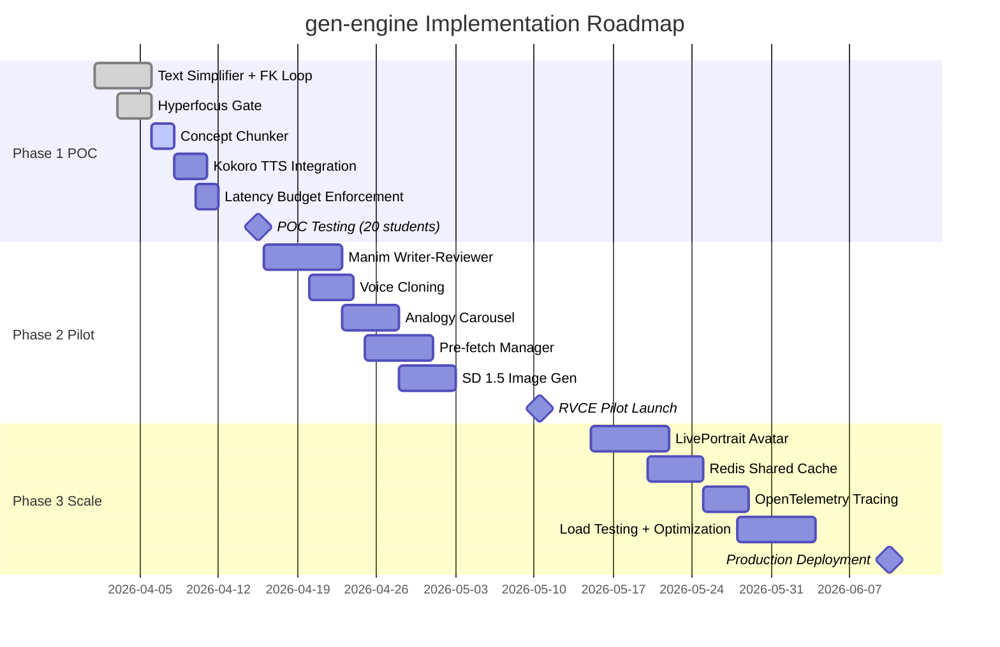

# 📋 gen-engine Product Specifications

**Version:** 1.0  
**Last Updated:** April 16, 2026  
**Owner:** Varun Aditya  
**Status:** Design Locked, Implementation In Progress

---

## Table of Contents

1. [Product Overview](#product-overview)
2. [User Stories](#user-stories)
3. [Functional Requirements](#functional-requirements)
4. [Non-Functional Requirements](#non-functional-requirements)
5. [API Specifications](#api-specifications)
6. [Generator Specifications](#generator-specifications)
7. [Acceptance Criteria](#acceptance-criteria)
8. [Phase Roadmap](#phase-roadmap)

---

## Product Overview

### Vision

The gen-engine microservice transforms educational content into neurodivergent-optimized formats in real time, removing cognitive barriers that prevent ADHD, dyslexic, and autistic learners from accessing material that matches their ability level.

### Key Differentiators

| Feature | Generic Content Generator | gen-engine |
|---------|-------------------------|------------|
| Text simplification | LLM output, unverified | FK-verified, retry loop until target met |
| Visual generation | Unconstrained outputs | Autism-safe constraints mandatory |
| Audio narration | Default TTS voice | Calm preset + voice cloning for familiarity |
| Intervention timing | Always-on, interrupts flow | Hyperfocus protective gate |
| Latency experience | Blocking generation | Async pre-fetch, appears instant |

---

## User Stories

### US-1: ADHD Learner Overwhelmed by Dense Text

**As an** ADHD undergraduate struggling with a dense textbook slide  
**I want** the text to be automatically simplified to a readable level  
**So that** I can focus on understanding concepts rather than decoding complex sentences

**Acceptance Criteria:**
- Simplified text has FK grade ≤ 9.0
- Simplification completes in < 5 seconds
- Original meaning and factual accuracy preserved
- Learner is never shown unverified LLM output

---

### US-2: Dyslexic Learner Unable to Track Dense Paragraphs

**As a** dyslexic student who loses my place in walls of text  
**I want** content revealed one sentence at a time at my own pace  
**So that** I can read without regression loops and maintain comprehension

**Acceptance Criteria:**
- Text is chunked into individual sentences
- Each chunk is revealed only after explicit user action (spacebar/tap)
- Chunk completion rate is logged as engagement signal
- No automatic advancement (learner controls pacing completely)

---

### US-3: Autistic Learner Triggered by Chaotic Visuals

**As an** autistic learner sensitive to visual overstimulation  
**I want** all generated images to follow calm, simple design constraints  
**So that** I can view illustrations without sensory overload

**Acceptance Criteria:**
- Every image includes autism-safe negative prompt block
- Generated images are muted color palettes, no high contrast
- Composition is simple with one focal element and generous negative space
- Images that violate constraints are filtered before serving

---

### US-4: ADHD Learner in Hyperfocus State

**As an** ADHD student currently in a rare hyperfocus state  
**I want** the system to recognize this and not interrupt me  
**So that** I can maintain productive deep focus without disruption

**Acceptance Criteria:**
- Hyperfocus composite signal correctly identifies the state (precision > 0.85)
- System overrides Orchestrator action to action_id = 0 (Hold Course)
- No modal dialogs, notifications, or content changes during hyperfocus
- Hyperfocus protection logged for analytics

---

### US-5: STEM Student Struggling with Abstract Concept

**As a** physics student unable to visualize a force diagram from static text  
**I want** an animated visual explanation generated on demand  
**So that** I can see the concept in motion and build intuition

**Acceptance Criteria:**
- Manim animation is pedagogically accurate (concept correctly represented)
- Animation completes in < 30 seconds
- Writer-reviewer loop self-heals syntax errors automatically
- If Manim fails after 2 retries, fallback to static illustration + narration

---

### US-6: Learner Confused and Needs Alternative Explanation

**As a** learner who doesn't understand the current explanation  
**I want** to trigger an "escape hatch" that gives me 3 different analogies  
**So that** I can find the mental model that matches how my brain works

**Acceptance Criteria:**
- Escape hatch triggers within < 5 seconds of activation
- 3 distinct analogies are generated (not variations of the same idea)
- Learner selects which analogy helped → logged as preference signal
- Selected analogy type is weighted higher in future generations for this learner

---

## Functional Requirements

### FR-1: Text Simplification with FK Verification

**Priority:** P0 (Must Have for POC)

**Description:** Simplify text to target FK grade level with verification loop.

**Inputs:**
- `slide_content` (string): Original text
- `learner_level` (enum): `grade5` | `grade8` | `university`

**Outputs:**
- `simplified_text` (string): FK-verified output
- `fk_grade` (float): Actual FK score of output
- `original_fk` (float): FK score of input
- `chunks` (array): Sentence-level chunked version

**Processing:**
1. Load few-shot prompt template for target level
2. Call Gemma 4 E2B with simplification instruction
3. Compute FK score of output using textstat
4. If FK > target: retry with stricter prompt (max 2 attempts)
5. Return verified text or best attempt with warning flag

**Non-Functional:**
- Latency: p95 < 5s
- FK verification pass rate: > 85% first attempt

---

### FR-2: Concept Chunking Engine

**Priority:** P1 (POC Optional, Demo Impressive)

**Description:** Convert full-slide text into progressive reveal format.

**Inputs:**
- `text` (string): Full content
- `chunk_strategy` (enum): `sentence` | `clause` | `paragraph`

**Outputs:**
- `chunks` (array): Ordered list of text segments
- `metadata` (object): Chunk count, avg characters per chunk

**Processing:**
1. Parse text using spaCy sentence tokenizer
2. Split on sentence boundaries (or clause/paragraph as configured)
3. Return ordered array with metadata

**Non-Functional:**
- Latency: < 100ms (deterministic, no AI)
- Min chunk size: 10 characters (avoid single-word chunks)

---

### FR-3: Manim Animation Generation

**Priority:** P1 (Demo Showstopper)

**Description:** Generate pedagogically accurate STEM animations using Manim library.

**Inputs:**
- `concept` (string): High-level concept label (e.g., "projectile motion")
- `slide_content` (string): Full text description
- `content_type` (enum): `math` | `physics` | `algorithm` | `process`

**Outputs:**
- `video_url` (string): S3/local path to MP4 file
- `duration_ms` (int): Video length
- `render_logs` (string): Manim CLI output (for debugging)

**Processing:**
1. **Writer Step:** Gemma 4 E2B generates Manim Scene Python code
2. **Render Step:** Execute `manim -ql scene.py Scene`
3. If syntax error: **Reviewer Step:** Gemma 4 E2B fixes code, re-render
4. If still fails after 2 attempts: Fallback to Stable Diffusion static image

**Non-Functional:**
- Latency: p95 < 30s
- Writer-Reviewer success rate: > 90%
- Must be pre-fetched (never on-demand)

---

### FR-4: Hyperfocus Protective Gate

**Priority:** P0 (Core Safety Feature)

**Description:** Detect hyperfocus state and override Orchestrator action to prevent disruption.

**Inputs:**
- `state_vector` (object): All 9 signals including gaze, keystroke, idle

**Outputs:**
- `is_hyperfocus` (bool): Detection result
- `confidence` (float): Composite score 0-1

**Processing:**
1. Compute composite from 5 weighted signals:
   - Idle time < 2s → score 1.0
   - Keystroke CV < 0.3 → score 1.0
   - Gaze dispersion < 0.15 → score 1.0
   - Scroll velocity < 0.05 → score 1.0
   - Session duration > 1.5× learner avg → score 1.0
2. Weighted average: `composite = Σ(weight_i × score_i)`
3. If composite ≥ 0.75: Override to action_id = 0

**Non-Functional:**
- Latency: < 50ms (must not delay request)
- False positive rate: < 10% (verified against hand-labeled POC data)

---

### FR-5: Kokoro TTS with Voice Cloning

**Priority:** P1 (Differentiator)

**Description:** Generate narration audio with optional educator voice cloning.

**Inputs:**
- `text` (string): Narration script
- `voice_profile` (optional string): Base64-encoded 10s WAV sample

**Outputs:**
- `audio_url` (string): Path to WAV file
- `timestamps` (array): Per-word start/end times (for dyslexia highlighting)
- `duration_ms` (int): Total audio length

**Processing:**
1. If `voice_profile` provided: Kokoro voice mixing (blend with calm preset)
2. Call Kokoro-FastAPI `/v1/audio/speech` with speed=0.85
3. Extract word-level timestamps from response
4. Save WAV to storage, return URL + metadata

**Non-Functional:**
- Latency: p95 < 3s
- Audio quality: 44.1kHz WAV, 16-bit depth
- Voice cloning similarity: > 0.80 (MOS evaluation)

---

### FR-6: Analogy Carousel Escape Hatch

**Priority:** P1 (Engagement Recovery)

**Description:** Generate 3 distinct analogies when learner signals confusion.

**Inputs:**
- `slide_content` (string): Current concept
- `learner_history` (object): Past analogy preferences

**Outputs:**
- `analogies` (array[3]): Three distinct explanations
- `analogy_types` (array[3]): Classification (visual, sports, everyday, technical)

**Processing:**
1. Gemma 4 E2B: "Generate 3 distinct analogies for: {concept}"
2. Prompt includes constraint: "Ensure analogies use different domains"
3. Parse response into structured array
4. Return analogies + metadata for preference logging

**Non-Functional:**
- Latency: p95 < 5s
- Analogy distinctness: Cosine similarity between pairs < 0.6

---

## Non-Functional Requirements

### NFR-1: Latency Performance

| Tier | Target (p95) | Hard Timeout |
|------|-------------|-------------|
| Tier 1 | < 1s | 2s |
| Tier 2 | < 5s | 8s |
| Tier 3 | N/A (pre-fetched) | 45s |

### NFR-2: Availability

- **Uptime:** 99% (excludes planned maintenance windows)
- **Recovery Time:** < 5 minutes for Ollama/Kokoro restarts
- **Graceful Degradation:** All generators have fallback chains

### NFR-3: Scalability

- **Concurrent Users (Phase 1):** 20 learners (POC cohort)
- **Concurrent Users (Phase 2):** 100 learners (RVCE pilot)
- **Concurrent Requests:** 10 per instance (Tier 3 bottleneck)

### NFR-4: Data Privacy

- **No PII in Logs:** Slide content is hashed before logging
- **No External APIs:** All generation happens locally (Ollama, Kokoro, SD)
- **Session Isolation:** Cache keys include session_id — no cross-learner leakage

### NFR-5: Observability

- **Metrics:** Prometheus `/metrics` endpoint exposed
  - Request count by action_id
  - Latency histogram per generator
  - FK verification pass rate
  - Hyperfocus detection events
  - Cache hit rate
- **Logs:** Structured JSON logs (stdout) → collected by Promtail
- **Tracing:** OpenTelemetry spans for request flow (Phase 3)

---

## API Specifications

### Endpoint: `POST /api/generate`

Generate content for confirmed action.

**Request:**
```json
{
  "action_id": 2,
  "slide_content": "The mitochondria is the powerhouse of the cell...",
  "learner_level": "grade8",
  "session_id": "uuid-v4",
  "confidence": 0.74,
  "state_vector": {
    "cognitive_load": 0.82,
    "scroll_velocity": 0.03,
    "keystroke_cadence": 4.2,
    "idle_time": 1.8,
    "response_latency": 3.1,
    "preference_delta": 0.15,
    "regression_count": 7,
    "gaze_dispersion": 0.22,
    "hyperfocus_composite": 0.45
  }
}
```

**Response (200 OK):**
```json
{
  "action_id": 2,
  "content": {
    "simplified_text": "The mitochondria makes energy for the cell...",
    "fk_grade": 7.8,
    "original_fk": 12.3,
    "chunks": ["The mitochondria makes energy for the cell.", "This energy is called ATP.", ...]
  },
  "generation_time_ms": 2847,
  "cache_hit": false,
  "hyperfocus_override": false
}
```

**Response (204 No Content):**  
Returned when hyperfocus gate triggers or action_id = 0.

**Response (503 Service Unavailable):**  
Generator timeout exceeded all fallbacks, or resource exhaustion.

---

### Endpoint: `POST /api/prefetch`

Background generation for top-N action candidates.

**Request:**
```json
{
  "action_candidates": [3, 2],
  "slide_content": "Newton's first law states...",
  "session_id": "uuid-v4"
}
```

**Response (202 Accepted):**
```json
{
  "prefetch_started": true,
  "tasks_queued": 2,
  "estimated_completion_ms": 25000
}
```

---

### Endpoint: `GET /health`

Readiness probe for Kubernetes/Docker.

**Response (200 OK):**
```json
{
  "status": "healthy",
  "ollama_reachable": true,
  "kokoro_reachable": true,
  "disk_space_gb": 45.2,
  "cache_size_mb": 1830
}
```

---

## Generator Specifications

### Text Simplifier

| Parameter | Value |
|-----------|-------|
| Model | Gemma 4 E2B via Ollama |
| Prompt Template | `prompts/simplify_{level}.txt` |
| Max Retries | 2 |
| FK Targets | grade5: ≤6.0, grade8: ≤9.0, university: ≤13.0 |
| Fallback | Original text (unsimplified) |

---

### Manim Generator

| Parameter | Value |
|-----------|-------|
| Writer Model | Gemma 4 E2B |
| Reviewer Model | Gemma 4 E2B (same, different system prompt) |
| Render Quality | `-ql` (480p @ 15fps for speed) |
| Max Retry | 2 writer-reviewer loops |
| Fallback | Stable Diffusion static image |

---

### Kokoro TTS

| Parameter | Value |
|-----------|-------|
| Docker Image | `ghcr.io/remsky/kokoro-fastapi-cpu:v0.2.2` |
| Default Voice | `af_bella` |
| Speed | 0.85× (calm preset) |
| Output Format | 44.1kHz WAV |
| Fallback | Browser Web Speech API (frontend-side) |

---

### Stable Diffusion 1.5

| Parameter | Value |
|-----------|-------|
| Library | `diffusers` via Hugging Face |
| Model | `runwayml/stable-diffusion-v1-5` |
| Steps | 25 (speed/quality balance) |
| Negative Prompt | Autism-safe block (mandatory) |
| Fallback | Text-only content |

---

## Acceptance Criteria

### Phase 1 (POC — 3 Weeks)

**Must Have:**
- [ ] Text simplification with FK verification (FR-1)
- [ ] Hyperfocus protective gate (FR-4)
- [ ] Concept chunking engine (FR-2)
- [ ] Kokoro TTS with calm preset (FR-5 — without voice cloning)
- [ ] Latency budgets enforced for all generators
- [ ] Health endpoint returns accurate status

**Success Metrics:**
- Text simplification p95 latency < 5s
- FK verification pass rate > 85% first attempt
- Hyperfocus detection false positive rate < 10%
- Zero crashes during 20-student POC cohort

---

### Phase 2 (RVCE Pilot — 5 Weeks)

**Must Have:**
- [ ] Manim animation generation (FR-3)
- [ ] Voice cloning with Kokoro (FR-5 full)
- [ ] Analogy carousel escape hatch (FR-6)
- [ ] Pre-fetch manager (async Tier 3 generation)
- [ ] Stable Diffusion image generation with autism-safe constraints

**Success Metrics:**
- Manim writer-reviewer success rate > 90%
- Cache hit rate > 40%
- Voice cloning MOS > 4.0 (5-point scale)
- Analogy distinctness cosine similarity < 0.6

---

### Phase 3 (Production Scale — 8 Weeks)

**Must Have:**
- [ ] LivePortrait avatar generation
- [ ] Horizontal scaling with Redis shared cache
- [ ] OpenTelemetry distributed tracing
- [ ] A/B testing framework for generator variants

**Success Metrics:**
- Support 100 concurrent users
- p95 latency stable under load
- 99% uptime over 4-week period

---

## Phase Roadmap



---

<div align="center">

**Next:** [Design System](./design_system.md)

</div>