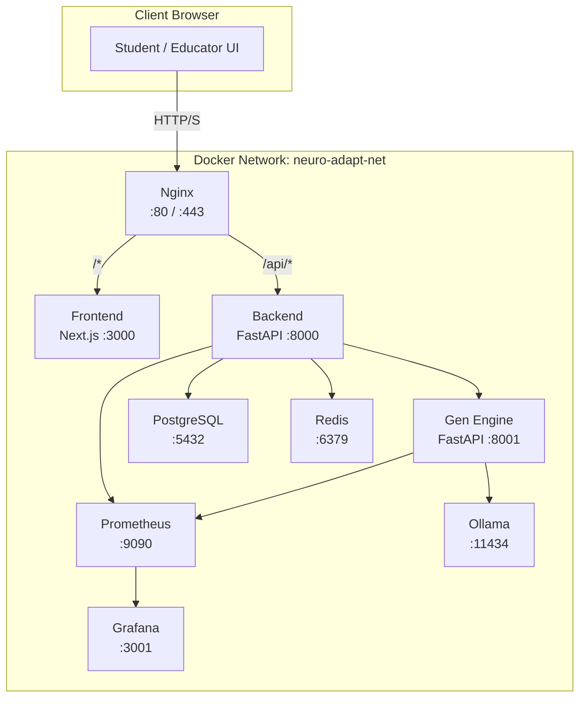
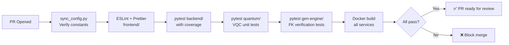
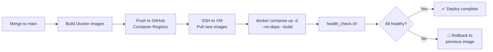

<div align="center">

# 🏗️ infra
### Docker Compose · Nginx · Prometheus · Grafana · CI/CD

*The scaffolding that holds everything together — from your laptop to the cloud.*

[](https://docker.com)
[](https://nginx.org)
[](https://prometheus.io)
[](https://grafana.com)
[](https://github.com/features/actions)

> **Primary Owner:** Varun Aditya
> **Supports:** All team members (shared deployment + CI environment)

</div>

---

## 🎯 Responsibility

The `infra/` module owns everything required to **run, monitor, and deploy** NeuroAdapt as a complete system:

- **Docker Compose** orchestration for all services (three environment variants)
- **Nginx** reverse proxy routing traffic between frontend and backend
- **Prometheus + Grafana** for real-time system health monitoring
- **GitHub Actions** CI/CD pipelines (lint → test → build → deploy)
- **Utility scripts** for config sync, seeding, and health checks

---

## 🗂️ Directory Layout

```
infra/
├── docker-compose.yml          # Production: all services + volumes + networking
├── docker-compose.dev.yml      # Dev: hot reload, local Ollama mount, verbose logs
├── docker-compose.test.yml     # CI: in-memory SQLite, mock Redis, no GPU required
│
├── nginx/
│   └── nginx.conf              # Routes /api/* → backend:8000, /* → frontend:3000
│
├── postgres/
│   └── init.sql                # Seed: 3 pre-baked demo learner profiles
│
├── monitoring/
│   ├── prometheus.yml          # Scrape config: API latency, Redis hit rate, queue depth
│   └── grafana/
│       └── dashboard.json      # Pre-built Grafana dashboard — import on first launch
│
└── scripts/
    ├── sync_config.py          # Generates config.ts + state_vector.ts from config.py
    ├── seed_demo.sh            # Loads demo profiles into Postgres
    └── health_check.sh         # Pings all services, reports status
```

---

## 🐳 Service Architecture



---

## 🌍 Environment Variants

### Production (`docker-compose.yml`)

```bash
docker compose -f infra/docker-compose.yml up --build -d
```

Full stack with:
- Persistent PostgreSQL volume
- Redis with `maxmemory-policy allkeys-lru`
- Nginx SSL termination (configure certificates in `nginx/`)
- Ollama with LLaMA-3 model pre-pulled

---

### Development (`docker-compose.dev.yml`)

```bash
docker compose -f infra/docker-compose.dev.yml up
```

Overrides for local development:
- **Hot reload** on frontend (Next.js dev server) and backend (uvicorn --reload)
- **Verbose logging** on all services
- **Local Ollama** bind-mounted from host (`~/.ollama`) — avoids re-downloading the model
- **Port 5432 exposed** for direct Postgres access via pgAdmin or psql

---

### Test / CI (`docker-compose.test.yml`)

```bash
docker compose -f infra/docker-compose.test.yml up --abort-on-container-exit
```

Optimised for GitHub Actions:
- **SQLite in-memory** instead of PostgreSQL (no disk I/O, instant startup)
- **Mock Redis** (fakeredis Python library)
- **No GPU required** — Stable Diffusion and Ollama are mocked with stub responses
- All services exit after test suites complete

---

## 🔀 Nginx Routing

```nginx
# nginx/nginx.conf (simplified)

upstream backend  { server backend:8000; }
upstream frontend { server frontend:3000; }

server {
    location /api/       { proxy_pass http://backend;  }
    location /health     { proxy_pass http://backend;  }
    location /           { proxy_pass http://frontend; }
}
```

> Nginx acts as the single entry point. The browser never directly addresses the FastAPI backend — all traffic flows through the proxy. This means the backend can be scaled horizontally without any frontend changes.

---

## 📊 Monitoring Stack

### Prometheus Scrape Targets

| Metric | Source | Alert Threshold |
|---|---|---|
| `api_request_latency_p50` | Backend `/metrics` | > 200ms |
| `api_request_latency_p99` | Backend `/metrics` | > 1000ms |
| `redis_hit_rate` | Redis exporter | < 80% |
| `gen_engine_queue_depth` | Gen Engine `/metrics` | > 10 pending |
| `vqc_inference_latency_p50` | Backend `/metrics` | > 200ms |

### Grafana Dashboard

Import `monitoring/grafana/dashboard.json` on first launch (Grafana → Dashboards → Import).

The pre-built dashboard includes:
- **API Latency** — p50/p95/p99 for all three endpoints
- **Intervention Frequency** — action_id distribution over time
- **Redis Performance** — hit rate, memory usage, eviction rate
- **Gen Engine Queue** — pending pre-fetch jobs, timeout rate
- **Reward Signal Timeline** — positive vs negative reward events per session

---

## 🔧 Scripts

### `sync_config.py` — The Most Important Script

```bash
python infra/scripts/sync_config.py
```

This script reads `shared_config.py` at the repo root and auto-generates:
- `shared/config.ts` — TypeScript constants for the frontend
- `shared/types/state_vector.ts` — TypeScript interfaces matching Pydantic models

**This runs as Step 1 of the CI pipeline.** If constants diverge between Python and TypeScript, the build fails before any code runs. It is the single most effective defence against the class of bugs where `TELEMETRY_INTERVAL` is 30,000 in Python and accidentally 3,000 in TypeScript.

---

### `seed_demo.sh`

```bash
bash infra/scripts/seed_demo.sh
```

Inserts three pre-baked learner profiles into Postgres for demos:

| Profile | Signal Characteristics | Shows Off |
|---|---|---|
| `adhd_demo` | Oscillating FP, burst IJ, intermittent stall | Action 1 (nudge) → Action 4 (game) flow |
| `dyslexia_demo` | Persistently high SDR on text slides | Action 2 (simplify) → convergence |
| `neurotypical_demo` | Stable moderate signals | Action 0 (hold course) dominant |

---

### `health_check.sh`

```bash
bash infra/scripts/health_check.sh
```

Pings all services and prints a status table. Use before demos to confirm everything is live:

```
✅ Frontend     http://localhost:3000         200 OK
✅ Backend      http://localhost:8000/health  200 OK
✅ Gen Engine   http://localhost:8001/health  200 OK
✅ PostgreSQL   localhost:5432                Connected
✅ Redis        localhost:6379                PONG
✅ Prometheus   http://localhost:9090         200 OK
✅ Grafana      http://localhost:3001         200 OK
```

---

## 🚀 CI/CD Pipelines

### `ci.yml` — Runs on Every PR



### `deploy.yml` — Runs on Merge to `main`



### `retrain.yml` — Scheduled Cron (Nightly)

```yaml
on:
  schedule:
    - cron: '0 2 * * *'   # 2 AM IST nightly
```

Reads the last 24 hours of replay data from Postgres, runs 50 training epochs, saves a new checkpoint. If the new checkpoint's validation reward is lower than the current production checkpoint, the update is rejected.

---

## 🧪 Running the Full Stack Locally

```bash
# 1. Sync constants
python infra/scripts/sync_config.py

# 2. Pull LLaMA-3 model (one time, ~4GB)
ollama pull llama3

# 3. Launch
docker compose -f infra/docker-compose.dev.yml up --build

# 4. Seed demo data
bash infra/scripts/seed_demo.sh

# 5. Verify
bash infra/scripts/health_check.sh
```

---

## 🔗 Connected Modules

| Module | Connection |
|---|---|
| [`frontend/`](../frontend/README.md) | Containerised as `frontend` service |
| [`backend/`](../backend/README.md) | Containerised as `backend` service |
| [`gen-engine/`](../gen-engine/README.md) | Containerised as `gen-engine` service |
| [`quantum/`](../quantum/README.md) | Nightly retrain via `retrain.yml` |
| [`shared/`](../shared/README.md) | `sync_config.py` generates files here |

---

<div align="center">

*Part of the [NeuroAdapt](../README.md) monorepo*
**🏗️ One command to launch. One dashboard to watch. Zero surprises in production.**

</div>
