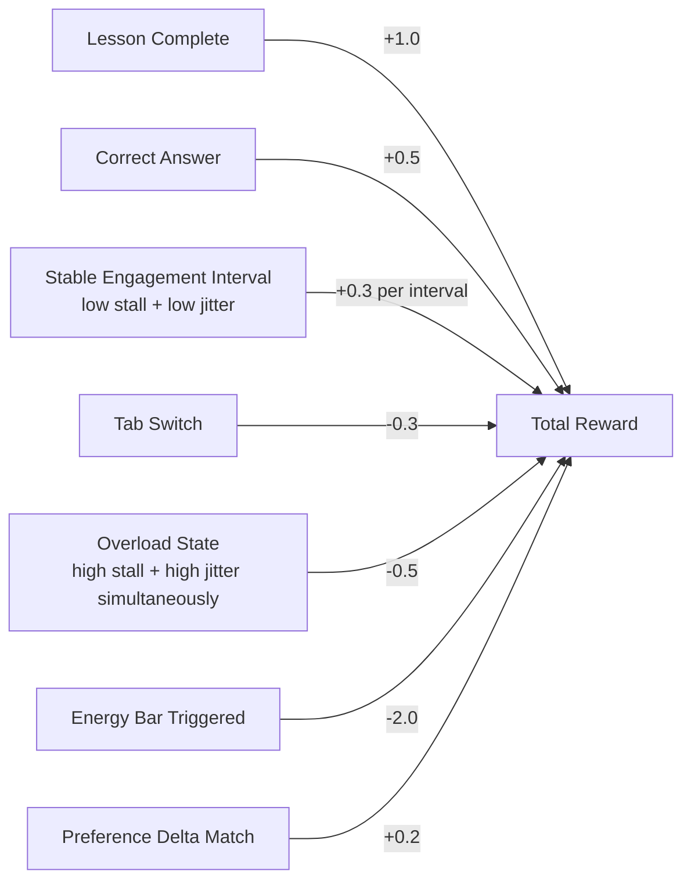
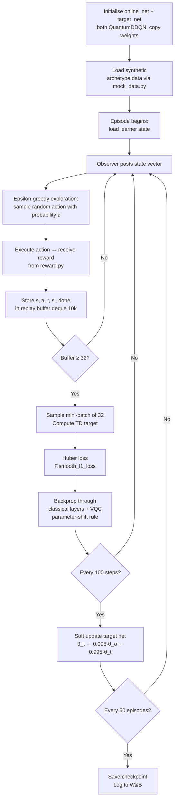

<div align="center">

# ⚛️ quantum
### Variational Quantum Circuit · Double DQN · Reward Engineering

*The cognitive core of NeuroAdapt — where quantum mechanics meets reinforcement learning.*

[](https://pennylane.ai)
[](https://pytorch.org)
[](https://wandb.ai)
[](https://qiskit.org)

> **Primary Owner:** Sudarshan S. Niranjan
> **Supports:** Varun (reward.py, retrain.py) · Prarthana (visualise_circuit.py, W&B dashboard)

</div>

---

## 🎯 Responsibility

The `quantum/` module owns the entire **decision-making intelligence** of NeuroAdapt:

- The **Variational Quantum Circuit (VQC)** that encodes the learner's cognitive state into Hilbert space
- The **Double Deep Q-Network (DDQN)** that uses the VQC as its feature extractor
- The **Stability Reward function** that shapes the policy toward cognitive safety, not just academic performance
- The **offline re-training pipeline** that keeps the model improving between live sessions
- All **ablation experiments** that validate the quantum advantage

---

## 🗂️ Directory Layout

```
quantum/
├── pennylane_vqc.py        # VQC circuit + QuantumDDQN class (Dueling streams)
├── train.py                # DDQN training loop, W&B logging, checkpoint saving
├── retrain.py              # Offline re-training from Postgres replay table
├── reward.py               # Full reward function (YAML-configurable weights)
├── mock_data.py            # 3 synthetic learner archetypes for pre-training
├── visualise_circuit.py    # qml.draw → PNG circuit diagram for report
├── ablation_classical.py   # VQC vs classical dense layer — convergence comparison
│
├── ablations/
│   ├── ablation_a.py       # Zero out each signal — measure Pref Delta impact
│   └── ablation_b.py       # Reduce action space to 3 — API cost vs engagement
│
├── configs/
│   ├── reward_weights.yaml # Configurable reward term weights
│   └── training_config.yaml # Hyperparameters: gamma, epsilon, batch_size, etc.
│
├── checkpoints/            # Saved model weights (gitignored, Docker volume mounted)
│   └── .gitkeep
│
└── __tests__/
    ├── test_vqc.py
    ├── test_reward.py
    └── test_boltzmann.py
```

---

## ⚛️ Why a VQC Inside a DDQN?

A standard DDQN uses two fully-connected classical layers as its feature extractor. NeuroAdapt replaces the inner hidden layer with a Variational Quantum Circuit.

| Property | Classical Dense Layer | Variational Quantum Circuit |
|---|---|---|
| State space representation | Linear weight matrix | 2⁵ = 32-dimensional Hilbert space |
| Signal correlation modelling | Sequential (one dimension at a time) | Simultaneous via entanglement |
| Early convergence speed | Baseline | **Measurably faster (Bhatia 2025, Cao 2025)** |
| Parameter count | ~25 weights for 5×5 | 5 trainable rotation angles |
| ADHD hyperfocus detection | Requires explicit feature engineering | Natural via CNOT entanglement |

> The key advantage for NeuroAdapt is not marginal accuracy improvement at convergence — it is **faster learning in the first 20–40 episodes**, exactly the window where a new learner's profile must be established before they disengage.

---

## 🔬 VQC Architecture

The circuit has three layers applied to **5 qubits** (one per Observer signal):

```mermaid
flowchart LR
    subgraph ENC["Encoding Layer"]
        direction TB
        Q0["Qubit 0
RX(SDR)"]
        Q1["Qubit 1
RX(IJ)"]
        Q2["Qubit 2
RX(FP)"]
        Q3["Qubit 3
RX(SD)"]
        Q4["Qubit 4
RX(PD)"]
    end

    subgraph ENT["Entanglement Layer"]
        direction TB
        C01["CNOT 0→1"]
        C12["CNOT 1→2"]
        C23["CNOT 2→3"]
        C34["CNOT 3→4"]
    end

    subgraph VAR["Variational Layer"]
        direction TB
        R0["RY(θ₀)"]
        R1["RY(θ₁)"]
        R2["RY(θ₂)"]
        R3["RY(θ₃)"]
        R4["RY(θ₄)"]
    end

    subgraph MEAS["Measurement"]
        M["⟨Z⟩ × 5
→ 5 classical outputs"]
    end

    ENC --> ENT --> VAR --> MEAS
```



### The ADHD Hyperfocus Entanglement

The CNOT chain `2→3` (Focus Persistence → Stall Duration) is a deliberate design choice. It encodes the clinically important correlation:

- **High Focus + High Stall** → deep thinking / processing (do NOT interrupt)
- **Low Focus + High Stall** → executive function paralysis (intervene immediately)

A classical dense layer processes these signals independently and frequently misclassifies hyperfocus as paralysis. The CNOT entanglement captures the joint state natively.

---

## 🏆 The Stability Reward Function

> This is the most philosophically significant design decision in NeuroAdapt.

Conventional RL tutors reward **correctness**. NeuroAdapt rewards **cognitive stability**.



All weights are configurable in `configs/reward_weights.yaml` — no code changes needed for tuning.

**Why the Stability Bonus matters:** A policy optimising only for correctness may extract correct answers from an overloaded learner by making content progressively easier. The Stability Bonus teaches the Orchestrator that **allowing overload to persist is worse than interrupting a lesson**, even at the cost of reduced throughput.

---

## 🏃 DDQN Training Loop



> 💡 **Epsilon-greedy exploration** is used during offline training to balance exploration and stability while the policy is trained on synthetic datasets.

---

## 🧬 Synthetic Learner Archetypes

`mock_data.py` generates three pre-training datasets (500 episodes each) to seed the population-level prior before any real learner data is collected:

| Archetype | Signal Profile | Purpose |
|---|---|---|
| **ADHD Hyperfocus** | High FP, low IJ, very low SD → sudden high SD + high IJ bursts | Train policy to detect paralysis onset |
| **Dyslexia Slow-Reader** | Consistently high SDR, moderate IJ, stable FP | Train policy to favour simplified text early |
| **Neurotypical Control** | Moderate all signals, consistent patterns | Establish baseline Q-value distribution |

---

## 🔬 Ablation Experiments

Three ablations validate the design choices:

| Ablation | What Changes | What It Measures |
|---|---|---|
| **A** | Zero-out each Observer signal one at a time | Impact on Preference Delta convergence speed |
| **B** | Reduce action space: 6 → 3 (hold, simplify, break) | API cost savings vs engagement quality tradeoff |
| **C** | Replace VQC with `nn.Linear(5,5)` (same param count) | **Quantum advantage: convergence epochs to Δ < 0.1** |

> Ablation C is the most important result for the Unisys submission. It directly answers: "Does the quantum layer actually help?" Run both on synthetic data for 300 episodes and export the convergence plot.

---

## 📈 Training a New Model

```bash
cd quantum

# Install requirements
pip install -r requirements.txt

# Generate synthetic archetype data
python mock_data.py --episodes 500 --steps 20 --out quantum/data

# Pre-train on synthetic archetypes
python -m quantum.train --data-dir quantum/data --episodes 200 --steps-per-episode 20

# Fine-tune on POC cohort data (after Phase 4)
python retrain.py --learner-id <uuid> --epochs 50

# Run Ablation A (Observer Signal Importance)
python -m quantum.ablations.ablation_a --episodes 300 --steps-per-episode 20

# Run Ablation B (Action Space Reduction)
python -m quantum.ablations.ablation_b --episodes 300

# Run Ablation C (Quantum Advantage vs Classical)
python -m quantum.ablation_classical --episodes 300 --steps-per-episode 20
```

---

## 🛣️ Qiskit Migration Path

See [`QISKIT_MIGRATION.md`](QISKIT_MIGRATION.md) for full details. The key change:

```python
# POC (simulator)
dev = qml.device("default.qubit", wires=N_QUBITS)

# Phase 3 (NISQ cloud)
dev = qml.device("qiskit.ibmq", wires=N_QUBITS, backend="ibmq_lima")
```

Noise models and decoherence will affect VQC outputs on real hardware. The migration doc covers expected performance degradation and mitigation strategies.

---

## 🧪 Running Tests

```bash
cd quantum
pytest __tests__/ -v

# Specific tests
pytest __tests__/test_vqc.py -v          # VQC circuit unit tests
pytest __tests__/test_boltzmann.py -v    # Exploration strategy comparison
```

---

## 🔗 Connected Modules

| Module | Connection |
|---|---|
| [`backend/`](../backend/README.md) | Receives state vectors, returns `action_id` + confidence |
| [`gen-engine/`](../gen-engine/README.md) | Triggers generation via confidence gate |
| [`frontend/`](../frontend/README.md) | Preference Delta chart in W&B embedded dashboard |
| [`shared/`](../shared/README.md) | Imports `config.py` constants |

---

<div align="center">

*Part of the [NeuroAdapt](../README.md) monorepo*
**⚛️ Five qubits. Six interventions. One learner who finally feels understood.**

</div>
