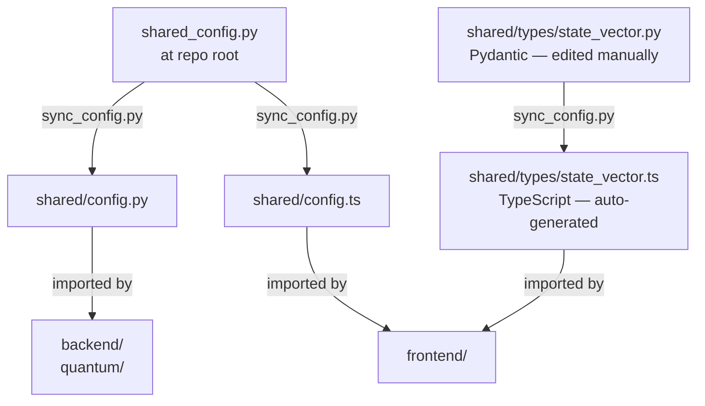

<div align="center">

# 🔗 shared
### Constants · Types · Single Source of Truth

*The contract between every module in NeuroAdapt — no magic numbers, no type drift.*

[](../infra/scripts/sync_config.py)
[](https://docs.pydantic.dev)
[](https://typescriptlang.org)

> **Primary Owner:** Prarthana Upadhyaya (TypeScript types)
> **Supports:** Sudarshan (Pydantic models) · All (read-only consumers)

</div>

---

## 🎯 Responsibility

The `shared/` folder solves one critical problem: **preventing constants and types from diverging between the Python backend and the TypeScript frontend.**

In a monorepo with three developers, the same constant can easily be set to different values in different files. The `shared/` module makes this structurally impossible.

---

## 🗂️ Directory Layout

```
shared/
├── config.py           # ⚠️ AUTO-GENERATED from ../shared_config.py — do not edit
├── config.ts           # ⚠️ AUTO-GENERATED from ../shared_config.py — do not edit
└── types/
    ├── state_vector.py # Pydantic v2 models (authoritative)
    └── state_vector.ts # TypeScript interfaces (auto-generated from .py)
```

> 📝 The authoritative source is **`../shared_config.py`** in the repo root.
> Run `python infra/scripts/sync_config.py` to regenerate all files in this folder.

---

## ⚙️ Constants Reference

These constants are shared across `backend/`, `quantum/`, `gen-engine/`, and `frontend/`:

| Constant | Value | Used By |
|---|---|---|
| `STATE_VECTOR_DIM` | `5` | Observer, Orchestrator, all API schemas |
| `ACTION_SPACE` | `6` | Orchestrator, ContentRenderer, reward.py |
| `N_QUBITS` | `5` | VQC circuit (must equal `STATE_VECTOR_DIM`) |
| `GAMMA` | `0.99` | DDQN discount factor |
| `EPSILON_START` | `1.0` | Exploration schedule |
| `EPSILON_END` | `0.05` | Exploration schedule |
| `EPSILON_DECAY_EP` | `500` | Exploration schedule |
| `REPLAY_CAPACITY` | `10_000` | Replay buffer max size |
| `BATCH_SIZE` | `32` | DDQN mini-batch size |
| `TARGET_UPDATE_FREQ` | `100` | Steps between soft target net updates |
| `CONFIDENCE_GATE` | `0.60` | Min Q-value to trigger gen engine |
| `TELEMETRY_INTERVAL` | `30_000` | Observer polling interval (ms) |
| `TRAJECTORY_WINDOW` | `3` | State vectors in trajectory buffer |
| `COLD_START_PD` | `0.5` | Neutral prior for PD_prev in Session 1 |
| `ACTION_COOLDOWN_MIN` | `2` | Minimum intervals between disruptive actions |

---

## 📐 Type Definitions

### `StateVector`

```typescript
// shared/types/state_vector.ts (auto-generated)
export interface StateVector {
  session_id: string;           // UUID
  state_vector: [number, number, number, number, number]; // [SDR, IJ, FP, SD, PD]
  timestamp: number;            // Unix timestamp
}

export interface TrajectoryWindow {
  session_id: string;
  vectors: [StateVector, StateVector, StateVector]; // 3×5 dimensions
}
```

```python
# shared/types/state_vector.py (authoritative Pydantic model)
class StateVector(BaseModel):
    session_id: UUID
    state_vector: Annotated[list[float], Len(5)]  # [SDR, IJ, FP, SD, PD]
    timestamp: int

class TrajectoryWindow(BaseModel):
    session_id: UUID
    vectors: Annotated[list[StateVector], Len(3)]
```

---

## 🔄 Sync Workflow



> ⚠️ **Never edit `config.ts` or `state_vector.ts` directly.** Edit `shared_config.py` or `state_vector.py` and run the sync script. The CI pipeline runs sync as its first step and will reject PRs where generated files are out of date.

---

## 🔗 Connected Modules

All modules consume from `shared/`. None write to it directly.

| Module | What It Uses |
|---|---|
| [`frontend/`](../frontend/README.md) | `config.ts`, `state_vector.ts` |
| [`backend/`](../backend/README.md) | `config.py`, `state_vector.py` |
| [`quantum/`](../quantum/README.md) | `config.py` |
| [`gen-engine/`](../gen-engine/README.md) | `config.py` |

---

<div align="center">

*Part of the [NeuroAdapt](../README.md) monorepo*
**🔗 One truth. Every module in agreement. No surprises.**

</div>
